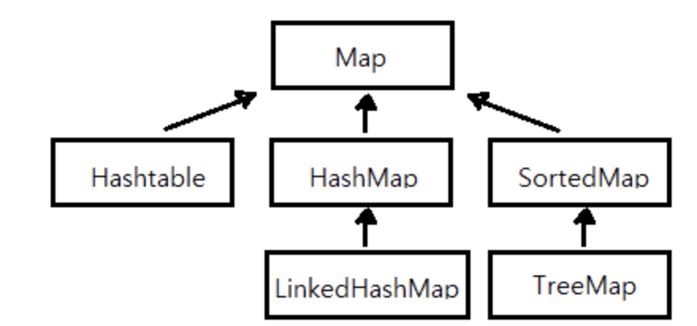

# 컬렉션 프레임웍(Collections Framework)

컬렉션 프레임웍이란, '데이터 군을 저장하는 클래스들을 표준화한 설계'를 뜻한다. 즉 **다수의 데이터를 저장하는 표준화된 프로그래밍 방식**을 말한다.

## 컬렉션 프레임웍의 핵심 인터페이스

컬렉션 프레임웍에서는 컬렉션 데이터 그룹을 크게 3가지 타입이 존재한다고 인식하고 3개의 인터페이스를 정의하였다. 이중 List와 Set의 공통적인 부분을 뽑아서 Collection이라는 인터페이스를 정의하였고, Map인터페이스는 상속계층도에 포함하지 않았다.

<p align="center"></p>

- List
  - 순서가 있는 데이터의 집합. **데이터의 중복을 허용**한다
  - 구현클래스 : ArrayList, LinkedList, Stack, Vector 등
- Set
  - 순서를 유지하지 않는 데이터의 집합. **데이터의 중복을 허용하지 않는다**.
  - 구현클래스 : HashSet, TreeSet 등
- Map
  - 키(Key)와 값(value)의 쌍(pair)으로 이루어진 데이터의 집합
  - 순서는 유지되지 않으며, 키는 중복을 허용하지 않고, 값은 중복을 허용한다.
  - 구현클래스 : HashMap, TreeMap, Hashtable, Properties 등

컬랙션 프레임웍의 모든 컬랙션 클래스들은 List, Set, Map 중의 하나를 구현하고 있으며, 구현한 인터페이스의 이름이 클래스의 이름에 포함되어 있어서 이름만으로도 클래스의 특징을 쉽게 알 수 있다.

## Collection 인터페이스

<p align="center"></p>
 
위의 사진은
[공식문서](https://docs.oracle.com/javase/8/docs/api/java/util/Collection.html) 에 적혀있는 List와 Set의 조상인 Collection 인터페이스에 정의되어 있는 메서드 들이다.

Collection 인터페이스는 다음과 같은 기능이 포함되어 있다.

- 저장된 데이터를 읽기 (contains, size, iterator)
- 데이터 추가하기 (add, addAll)
- 데이터 삭제하기 (remove, clear ...)

## List인터페이스

List는 중복을 허용하면서 저장순서가 유지되는 컬렉션이다.

<p align="center"></p>
위의 사진과 같은 상속 계층도를 그리고 있다.

List인터페이스에 관해 [공식문서](https://docs.oracle.com/javase/8/docs/api/java/util/Collection.html)에서 정의된 메서드들은 다음과 같다.

<p align="center"></p>

- 위의 사진은 일부이고 더 자세한 내용은 공식문서를 통해서 확인해보면 좋을 것 같다.
- List 인터페이스를 구현한 Vector, ArrayList, LinkedList에는 List인터페이스의 메서드들을 당연히 사용할 수 있다.

## Set인터페이스

Set은 중복을 허용하지 않고 저장순서가 유지되지 않는 컬렉션 클래스이다. 아래와 같은 상속계층도를 따른다.

<p align="center"></p>

## Map인터페이스

Map은 키(key)와 값(value)을 하나의 쌍으로 묶어서 저장하는 컬랙션 클래스이다.

키는 중복될 수 없지만 값은 중복을 허용한다.

<p align="center"></p>
<p align="center"></p>

### Map.Entry 인터페이스

Map.Entry 인터페이스는 Map인터페이스의 내부 인터페이스(innerInterface)이다. Map인터페이스를 구현하면 Map.Entry 인터페이스도 반드시 함께 구현해야 한다.

```java
public interface Map{
	...

	public static interface Entry{
		Object getKey(); // Entry의 key객체를 반환
		Object getValue(); // Entry의 Value 반환
		Object setValue(Object value); // Entry에 value 객체를 지정된 객체로 바꿔준다.
		boolean equals(Object o); // 동일한 Entry인지 비교한다
		int hashCode(); // Entry의 해쉬코드 반환
		...
	}
}
```

# ArrayList

- ArrayList 는 List인터페이스를 구현해기 때문에 데이터의 저장순서가 유지되고 중복을 허용한다는 특징을 갖는다.
- 기존의 Vector를 개선 Vector보다는 ArrayList를 사용하자
- ArrayList는 배열에 더 이상 저장할 공간이 없으면 보다 큰 새로운 배열을 생성해서 기존의 배열의 내용을 복사한 다음 저장한다.
- ArrayList는 실제 공간보다 더 큰 객체가 들어가면, 현재 객체를 저장하고 자동적으로 복사한뒤 크기를 증가시키는 과정을 거치는데, 이 과정에서의 처리시간이 많이 소요되기 때문에 적당하게 저장할 요소의 개수로 만드는게 좋다.

<p biialign="center"></p>

ArrayList에 있는 메서드이다. 더 자세한 내용은 [공식문서](https://docs.oracle.com/javase/8/docs/api/java/util/ArrayList.html)를 참고하자.

# LikedList

배열은 모든 데이터가 연속적으로 존재하지만 링크드 리스트는 불연속적으로 존재하는 데이터들을 서로 연결(link)한 형태로 구성되어있다.

- 배열처럼 데이터를 이동하기 위해 복사하는 과정이 없기 때문에 데이터를 삭제하거나 삽입하는 데에 걸리는 속도가 빠르다.

```java
class Node{
	Node next;
	Object obj;
}
```

다음과 같이 한 Node에서 다음 Node의 주소를 참조하고 있는 데이터구조가 LikedList 이다.

하지만 LinkedList는 이동방향이 단방향이기 때문에 다음 요소에는 쉽게 접근할 수 있지만 이전 요소는 접근 하기 힘들다. 따라서 이를 극복하기 위해 더블 링크드 리스크(doubly liked list)가 생겼다.

```java
class Node{
	Node next;
	Node previous;
	Object obj;
}
```

다음과 같이 더블 링크드 리스트는 단순히 링크드 리스트에 참조변수를 하나 추가하여 이전 요소에 대해 참조 할 수 있게 한 구조이다.

실제 LikedList클래스는 이름과 달리 더블 링크드 리스트로 구현되어 있다.

```java
boolean add(Object o)
// 지정된 객체(o)를 LinkedList 끝에 추가, 저장에 성공하면 true, 실패하면 false
void add(int index, Object element)
// 지정된 위치(index)에 객체(element)를 추가
void clear()
// LinkedList의 모든 요소를 삭제
Object peekFirst()
// LinkedList 의 첫번째 요소를 반환
Object pollFirst()
//LinkedList 의 첫번째 요소를 반환, LinkedList에서는 제거된다
Object peekLast()
// 마지막 요소를 반환
Object pollLast()
// 마지막 요소를 반환하면서 제거
```

위와 같은 함수들이 있고, 더 다양한 함수들에 대한 설명은 [공식문서](https://docs.oracle.com/javase/8/docs/api/java/util/LinkedList.html)를 참고하자

## ArrayList와 LinkedList의 성능비교

### 순차적으로 추가및 삭제하기 : ArrayList가 LinkedList 보다 빠르다

- 순차적으로 추가할 때는 ArrayList같은 경우에는 맨 뒤에 데이터를 추가히기만 하면 되므로 더 빠르다
- 단 ArrayList의 크기가 충분하지 않아서 배열을 복사해야 하는 경우 LinkedList가 ArrayList보다 더 빠를 수 있다.

### 중간에 추가및 삭제하기 : LinkedList가 ArrayList 보다 빠르다

- LinkedList 같은 경우 중간에 추가를 하던 마지막에 추가를 하든 각 요소간의 연결만 변경해주면 된다.
- ArrayList는 중간에 데이터를 추가하거나 삭제를 할 때마다 각 요소들을 재 배치 해주어야 하기 때문에 소요시간이 길다.

### 데이터에 접근하기 : ArrayList가 LinkedList 보다 빠르다.

ArrayList의 경우

> 인덱스가 n인 데이터의 주소 = 배열의 주소 + n \* 데이터 타입의 크기

로 접근하면 되기 떄문에 속도는 O(1)이지만, LinkedList의 경우 필요한 데이터에 접근하기 위해 앞에서 부터 순차적으로 요소들을 확인해야하기 때문에 O(n)이 소요된다.

### 정리

ArrayList

- 데이터의 접근이 잦을 떄
- 데이터를 중간에 추가하는 경우가 많지 않을 때
- 데이터의 개수가 변하는 양이 많지 않을 때
  LinkedList
- 데이터의 접근이 잦지 않을 때
- 데이터를 중간에 추가하는 경우가 많을 때
- 데이터의 개수가 많이 변할 때

또한 처음에 데이터를 저장할 때는 ArrayList를 사용하다가, 데이터의 크기가 매우 커지면 LinkedList로 옮겨서 작업하는 것도 좋은 효율을 얻는 방법중의 하나이다.

# Stack과 Queue

스택(Stack) - LIFO(Last In First Out)

```java
boolean empty() // Stack이 비어있는지 아려준다
Object peek() // Stack의 맨위의 객체 반환, pop과 달리 꺼내진 않음. 없을시 Exception 발생
Object pop() // Stack 맨위의 저장된 객체를 꺼낸다 (비어있으면 Exception )
Object push(Object item) // Stack에 객체(item)을 저장한다
int search(Object o)
// Stack에서 주어진 객체(o)를 찾아서 그 위치를 반환. 못찾으면 -1 반환
//(Stack의 위치는 배열과 달리 1부터 시작)
```

큐(Queue) - FIFO(First In First Out)

```java
boolean add(Object o) // 지정된 객체를 Queue에 추가, 성공시 true 실패시 false
Object remove() // Queue에서 객체를 꺼내 반환, 비어있으면 예외 발생
Object element() // 삭제없이 요소만 읽어옴, 비어있으면 예외 발생
boolean offer(Object o) // queue에 객체를 저장, 성공시 true, 실패시  false
Object poll() // Queue에서 객체를 꺼내서 반환, 비어있으면 null 반환
Object peek() // 삭제없이 요소만 읽어옴. Queue가 비어있으면 null qksghks
```

자바에서 Stack은 Stack클래스로 구현하여 제공하지만 큐는 Queue인터페이스로 정의해 놓았을 뿐 별도의 클래스를 제공하고 있지 않다.

- Queue인터페이스를 구현한 클래스들이 많이 있기 때문에 이 들 중의 하나를 선택하여 사용하면 된다.

```java
Queue q = new LinkedList();
```

# PriorityQueue

- Queue인터페이스의 구현체 중의 하나로, 저장한 수선에 관계없이 우선순위 높은 것부터 꺼낼 수 있다.
- 저장공간으로 배열을 사용하며 ,각 요소를 힙(heap)의 형태로 저장한다.

```java
import java.util.*;

class PriorityQueueEx{
	public static void main(String[] args){
		Queue pq = new PriorityQueue();
		pq.offer(3);
		pq.offer(1);
		pq.offer(2);
		pq.offer(5);
		pq.offer(4);
		System.out.println(pq);

		Object obj = null;
		// 가장 최상단의 element가 존재하지 않을 때 까지 계속
		while((obj = pq.poll()) != null){
			System.out.println(obj);
		}
	}
}
```

# Dequeue(Double - Ended Queue)

- Dequeue(덱 또는 디큐)는 양쪽 끝에 추가/삭제가 가능하다.
- 디큐는 사실상 스택과 큐를 합쳐놓은 것으로 스택으로도, 큐로도 사용할 수 있다.
- 디큐의 조상은 Queue이며 구현체로는 ArrayDequeue, LinkedList 등이 있다.

```java
Dequeue dq = new LinkedList();
Dequeue dq = new Arraydequeue();

dq.offerLast() // 뒤에 값을 추가 stack의 push
dq.pollLast() // 뒤에 값을 제거 stack의 pop
dq.pollFirst() // 앞에 값을 확인, Queue의 poll
dq.peekFirst() // 앖의 값을 제거하고 받아옴, Queue의 peek함수
dq.peekLast() // 뒤에 값을 제거하고 받아옴
```

# Iterator, ListIteraotr, Enumeration

Enumeration 은 Iterator의 구버전이고, ListIterator는 Iterator의 기능을 향상 시킨 것이다.

## Iterator

- 컬렉션 프레임웍에서는 컬렉션에 저장된 요소들을 읽어오는 방법을 표준화 하였다
- 컬렉션에 저장된 각 요소에 접근하는 기능을 가진 Iterator 인터페이스이다.
- Iterator는 Collection 인터페이스에 정의된 메서드이므로 자손인 List와 Set에도 포함되어있으므로 List와 Set의 인터페이스를 구현한 class는 iterator를 사용할 수 있다.

```java
boolean hasNext() // 읽어올 요소가 남아있는지 확인하고 있으면 true, 없으면 false
Object next() // 다음요소를 읽어온다. next() 호출하기 전에 hasNext로 다음 값이 있는지 확인해야한다
void remove() // next()로 읽어 온 요소를 삭제한다, 즉 next()를 호출한 다음에 remove()를 호출해야한다.
```

ArrayList에서 사용하는 예시는 다음과 같다

```java
Collection c = new ArrayList();
Iterator it = c.iterator();

while(it.hasNext()){
	System.out.println(it.next());
}
```

이뿐만 아니라 다른 List, Set 인터페이스로 구현한 클래스들은 ArrayList 대신에 해당 클래스만 써주면 똑같이 사용할 수 있다.

- Iterator를 이용해서 컬렉션의 요소를 읽어오는 방법을 표준화 했기 때문이다.
  - 코드를 어떤 클래스가 오더라도 일관적으로, 재사용성을 높이며 사용할 수 있는 장점이 있따.

Map 인터페이스를 구현한 클래스는 키(key)와 값(value)을 쌍(pair)로 저장하기 때문에 iterator()를 직접 호출할 수 없고, keySet(), entrySet() 과 같은 메서드를 통해 key와 value를 각각 따로 Set의 형태로 받은 후 Iterator를 사용할 수 있다.

```java
Map map = new HashMap();
...
Iterator it = map.entrySet().iterator();
//이런식으로 먼저 set을 만들고 그 후에 iterator를 반환하여 사용할 수 있다.
```

## ListIterator

- ListIteraotr는 기존 Itertir에서 향상된 클래스이다.
- 양방향 이동이 가능하다.
- ArrayList나 LinkedList처럼 List 인터페이스를 구현한 컬렉션에서만 사용할 수 있다.

```java
ArrayList list = new ArrayList();
list.add("1");
list.add("2");
ListIterator it = list.listIterator();

void add(Object o) // 컬렉션에 새로운 객체 (o)를 추가한다
boolean hasNext() // 읽어올 다음 요소가 남아 있는지 확인한다 있으면 true, 없으면 false
boolean hasPrevious() // 읽어올 이전 요소가 남아 있는지 확인한다 있으면 true, 없으면 false
Object next() //다음 요소를 반환한다.
Object previous() // 이전요소를 반환한다.
int nextIndex() // 다음 요소의 index를 반환한다
int previousIndex() // 이전 요소의 index를 반환한다.
void remove() // next() 또는 previous()로 읽어 온 요소를 삭제한다
void set(Object o) // next 또는 previous()로 읽어온 요소를 지정된 객체(o)로 변경한다.
```

- next()나 previous()로 이동하기전에 반드시 hasNext, hasPrevious로 이동할 수 있는지 여부를 확인해야한다.
- set, remove 함수를 사용하기 전에는 반드시 next(), previous()를 먼저 호출하여 객체를 iterator가 가르켜야한다.

## Arrays 의 유용한 메서드

### fill(),

배열의 모든 요소를 지정한 값으로 채운다.

```java
int[] arr = new int[5];
Arrays.fill(arr, 9); // arr=[9,9,9,9,9]
```

### setAll(),

배열을 채우는데 사용할 함수형 인터페이스를 매개변수로 받아서 배열을 채운다.

```java
int[] arr = new int[5];
Arrays.setAll(arr, () => {(int)(Math.random()*5) + 1});
```

### sort()

sort()는 배열을 정렬할 때 사용한다

```java
int[] arr = {3, 2, 0, 1, 4};
Arrays.sort(arr); // [0, 1, 2, 3, 4];
```

sort함수에는 부분 정렬을 할 수 있다.

```java
int[] arr = {3, 2, 0, 1, 4};
Arrays.sort(arr, 1, 4); //[3, 0, 1, 2, 4]
//1~3번index까지의 요소만 정렬한다
```

### binarySearch()

- 배열에서 지정된 값이 저장된 위치(index)를 찾아서 반환한다.
- 이름처럼 이진 검색(binary search)를 사용하여 절반씩 줄여가며 검색하기에 검색속도가 빠르다.
- 단 **배열이 정렬되어 있는 경우에만** 사용이 가능하다.

# Comparator와 Comparable

Comparator와 Comparable은 모두 인터페이스로 컬렉션을 정렬하는데 필요한 메서드를 정의하고 있다.

```java
public interface Comparator{
	int compare(Object o1, Object o2);
	boolean equals(Object obj);
}
public interface Comparable{
	public int compareTo(Object o);
}
```

Compare()와 CompareTo()는 결국 두 객체를 비교한다는 같은 기능을 목적으로 고안된 것이다. compareTo()의 반환값은 int지만 실제로는 두 객체가 같으면 0, 작으면 음수, 크면 양수를 받환하도록 되어있다.

- Array.sort()를 호출만 하면 컴퓨터가 알아서 배열을 정렬하는 것처럼 보이지만 사실은 Comparable클래스의 구현에 의해 정렬된 것이다.
- Comparable을 구현하고 있는 클래스들은 같은 타입의 인스턴스끼리 서로 비교할 수 있는 클래스들(wrapper클래스, String, Date)과 같은 것들이며 기본적으로 오름차순이 되도록 구현되어 있다.
- Comparable을 구현한 클래스는 정렬이 가능하다는 것을 의미한다.

마찬가지로 compare()도 객체를 비교해서 음수, 0, 양수 중 하나를 반환하도록 구현해야 한다.

> Comparable : 기본 정렬기준은 구현하는데 사용

> Comparator : 기본 정렬기준 외에 다른 기준으로 정렬하고자 할 때 사용

```java
import java.utill.*;

class Descending implements Comparator{
	public int compare(Object o1, Object o2){
		if(o1 instaceof Comparable && o2 instaceof Comparable){
			Comparable c1 = (Comparable)o1;
			Comparable c2 = (Comparable)o2;
			return c1.compareTo(c2) * -1; // -1d을 곱해서 기본 정렬방식의 역으로 변경한다.
			// 또는 c2.compareTo(c1)으로 하면 역순배열이 된다.
		}
		return -1;
	}
}

class ComparatorEx{
	public static void main(String[] args){
		String[] strArr = {"cat", "Dog", "lion", "tiger"};

		Array.sort(strArr); //String의 Comparable구현에 의한 정렬

		Arrays.sort(strArr, new Descending()) // 역순 정렬
	}
}
```

### 람다함수로 Comparator 객체 대체

Comparator 객체는 메서드가 하나뿐인 함수형 인터페이스를 구현하기 때문에 람다함수로 대체가 가능하다

```java
Collections.sort(playrs, (a,b) => b.getScore() - a.getScore()); //이런식으로 람다식을 인자로 넣어주느것으로 대체 가능하다.
```

# Reference

사진 : https://perfectacle.github.io/2017/08/05/Java-study-015day/
