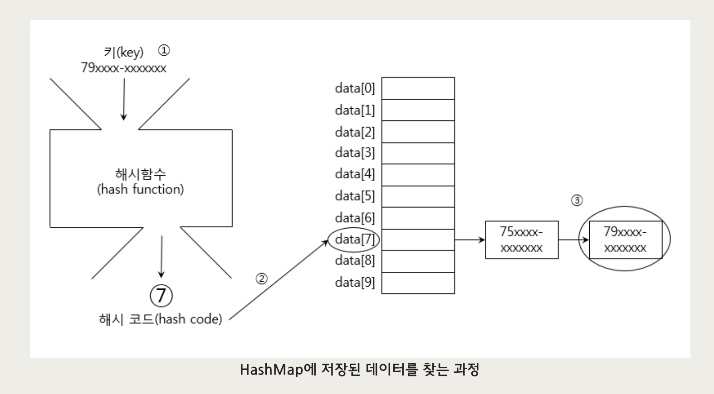

# HashSet

HashSet은 Set인터페이스를 구현한 컬렉션이다.

- Set인터페이스의 특징대로 HashSet은 중복된 요소를 저장하지 않는다. 중복된 요소 추가시 false 반환
- 저장순서를 유지하고 싶으면 LinkedHashSet을 사용해야한다.

```java
HashSet() // HashSet 객체 생성
boolean add(Object o) // 새로운 객체를 저장한다
boolean addAll(Collection c) // 주어진 커렉션에 저장된 모든 객체들을 추가한다.
void clear() // 저장된 모든 객체를 삭제한다
boolean contains(Object o) // 지정된 객체를 포함하고 있는지 알려준다
boolean conatainsAll(Collection c) // 주어진 컬렉션에 저장된 모든 객체들을 포함하고 있는지 알려준다.
boolean remove(Object o) // 지정된 객체를 HashSet에서 삭제한다
boolean removeAll(Collection c) // 주어진 컬렉션에 저장된 모든 객체와 동일한 것들을 HashSet에서 삭제한다.
boolean retainAll(Collection c) // 주어진 컬렉션에서 저장된 객체와 동일한 것만 남기고 다 삭제한다.

```

다음과 같은 함수들이 있고 자세한 상황은 [공식문서](https://docs.oracle.com/javase/8/docs/api/java/util/HashSet.html)를 확인하자

## HashSet의 요소 판별

HashSet의 add메서드는 새로운 요소를 추가하기 전에 기존에 저장된 요소와 같은 것인지 판별하기 위해 추가하려는 요소의 equals()와 hashCode()를 호출한다.

HashSet에서는 두 객체의 해시코드가 같고, equals메서드를 호출한 결과가 같아야지만 두 객체를 같다고 판단한다.

### hashCode()

요소를 같은 것인지 판별하기 위해서 hashCode 메서드를 호출하며 이를 목적에 맞게 오버라이딩하여 사용해야한다.

```java
public int hashCode(){
	return (name+age).hashCode();
}
```

위에 예시처럼 기존의 hash코드를 사용하는 것이 아니라 String클래스의 hashCode()가 잘 구현되어 있기 때문에 이를 사용하여 이렇게 구현할 수도 있다.

또는 Object클래스의 hash()를 이용해서도 hashCode함수를 오버라이딩할 수 있다.

```java
public int hashCode(){
	return Objects.hash(name, age);
}
```

오버라이딩을 통해 작성한 hashCode() 함수는 다음의 세 가지 조건을 만족 시켜야 한다.

1. 실행중인 애프릴케이션 내의 동일한 객체에 대해서 여러 번 hashCode()를 호출해도 동일한 int값을 반환해야한다. 하지만 실행시마다, 동일한 int값을 반환할 필요는 없다.

2. equals메서드를 이용한 비교에 의해서 true를 얻은 두 객체에 대해 각각 hashCode()를 호출해서 얻은 결과는 반드시 같아야 한다.

3. equals메서드를 호출했을 때 false를 반환하는 두 객체는 hashCode() 호출에 대해 같은 int값을 반환하는 경우가 있어도 괜찮지만, 해싱(hashing)을 사용하는 컬렉션의 기능을 향상시키기 위해서는 다른 int값을 반환하는 것이 좋다

# TreeSet

이진 검색 트리 (binary search tree) 형태로 데이터를 저장하는 컬렉션 클래스이다.

- Set인터페이스를 구현했으므로 중복된 데이터의 저장을 허용하지 않으며 정렬된 위치에 저장하므로 저장순서를 유지하지 않는다.
- TreeSet은 이진검색트리를 사용했기 때문에 저장할 때 이미 데이터를 정렬한다.
- subSet() 함수를 이용해 범위 검색이 가능하다.
- 문자열의 경우 정렬순서는 공백 -> 숫자 -> 대문자 -> 소문자 순이다.

관련 메서드들은 [공식문서](https://docs.oracle.com/javase/8/docs/api/java/util/TreeSet.html)를 확인하자.

# HashMap

- HashMap은 Map인터페이스를 구현했기에 키(key)와 값(value)을 묶어서 **하나의 데이터(entry)** 로 저장한다.
- 해싱(hashing)을 사용했기에 다량의 데이터를 검색하는데에 뛰어난 성능을 보인다.

<p align="center"></p>

다음과 같은 관련 메소드들이 있고 더 자세이 알고 싶으면 [공식문서](https://docs.oracle.com/javase/8/docs/api/java/util/HashMap.html)를 참고하자.

## Map.Entry

iterator를 사용하는 동안 쓰는 interface이다. 즉 iterator로 받아오는 요소들을 assign해줄 대상으로 사용하면 된다. Map.Entry에는 각 요소를 접근하기 위한 메서드들이 있다.

<p align="center"></p>

```java
import java.util.*;

class HashMapEx{
	static HashMap phoneBook = new HashMap();

	public static void main(String[] args){
		addPhoneNo("친구", "이자바", "010-111-1111");
		addPhoneNo("친구", "김자바", "010-222-2222");
		addPhoneNo("친구", "김자바", "010-333-4444");
		addPhoneNo("회사", "김대리", "010-444-4444");
		addPhoneNo("회사", "김대리", "010-555-5555");
		addPhoneNo("회사", "박대리", "010-666-6666");
		addPhoneNo("회사", "이과장", "010-777-7777");
		addPhoneNo("세탁", "010-888-8888");

		printList();
	}

	static void addPhoneNo(String groupName, String name, String tel){
		addGroup(groupName);
		HashMap group = (HashMap)phoneBook.get(groupName);
		group.put(tel, name);
	}

	static void addGroup(String groupName){
		if(!phoneBook.containsKey(groupName))
			phoneBook.put(groupName, new HashMap());
	}

	static void addPhoneNo(String name, String tel){
		addPhoneNo("기타", name, tel);
	}
	static void printList(){
		Set set = phoneBook.entrySet();
		Iterator it = set.iterator();

		while(it.hasNext()){
			Map.Entry e = (Map.Entry)it.next();

			Set subSet = ((HashMap)e.getValue()).entrySet();
			Iterator subIt = subSet.iterator();

			System.out.println(" * " + e.getKey() + "[" + subSet.size() + "]");

			while(subIt.hasNext()){
				Map.Entry subE = (Map.Entry)subIt.nect();
				String telNo = (String)subE.getKey();
				String name = (String)subE.getValue();
				System.out.println(name + " " + telNo);
			}
			System.out.println();
		}
	}
}
```

위에 예제를 보면 HashMap의 사용에 대한 대략적인 방법을 알 수 있을 거 같다.

# 해싱과 해싱함수

해싱이란 해시함수(hashFunction)을 이용해서 데이터를 해시테이블(hash table)에 저장하고 검색하는 기법이다. 해시함수는 데이터가 저장되어 있는 곳을 알려주기 때문에 다량의 데이터 중에서도 원하는 데이터를 빠르게 찾을 수 있다.

<p align="center"></p>

HashMap에서 데이터를 찾는 과정은 위에 사진과 같다

1. 검색하고자 하는 값의 키로 해시함수를 호출한다
2. 해심함수의 계산 결과(해시코드)로 해당 값이 저장되어 있는 링크드 리스트를 찾는다.
3. 링크드 리스트에서 검색한 키와 일치하는 데이터를 찾는다.

위와 같은 프로세스에서 가장 빠른 방법은 역시 하나의 해시코드에 하나의 결과값만 있는 것이다.

그래서 실제로 Object클래스에 정의된 hashCode()함수는 객체의 주소를 이용하는 알고리즘으로 해시코드를 만들어 내기 때문에 모든 객체에 대해서 hashCode()를 호출한 결과가 서로 유일한 방법이다.

String클래스의 hashCode함수의 경우 Object로 부터 상속받은 hashCode()를 오버라이딩 하였는데, 문자열의 내용이 같다면 같은 hashCode()를 얻는다.

# TreeMap

- TreeMap은 이진검색트리의 형태로 만들어진 Map이다.
- 일반적으론 HashMap이 TreeMap보다 더 뛰어나지만, 범위검색이나 정렬이 필요한 경우에는 TreeMap을 사용하는 것이 좋다.

## Properties

- HashMap의 구버전인 HashTable을 상속받아 구현한 것이다.
- Hashtable은 키와 값을 (Object, Object)형태로 저장하는데 Properties는 (String, String)의 형태로 저장한다.

# Collections

## 동기화

각 컬랙션마다 동기화를 하기위한 클래스들을 만들 수 있다.

```java
static Collection synchronizedCollection(Collection c)
static List synchronizedList(List list)
static Set synchronizedSet(Set s)
static Map synchronizedMap(Map m)
static SortedSet synchronizedSortedSet(SortedSet s)
static SortedMap synchronizedSortedMap(SortedMap m)

// 다음과 같이 사용한다
List syncList = Collection.synchronizedList(new ArrayList[...])
```

## 변경불가 컬렉션 만들기

해당 클래스 앞에 unmodified키워드만 붙여주면 된다.

```java
static Collection unmodifiedCollection(Collection c)
static List unmodifiedList(List list)
...
```

## 싱글톤 컬랙션 만들기

싱글톤 즉 단 하나의 객체만을 저장하는 컬렉션을 만들 고 싶을 때 사용한다

```java
static List singletonList(Object o)
static Set singleton(Object o)
static Map singletonMap(Object key, Object value)
```

## 한 종류의 객체만 저장하는 컬렉션 만들기

컬렉션의 모든 종류의 객체를 저장할 수 있는 것은 장점이며 또한 단점이 될 수 있다. 한 종류의 객체만을 저장하고 싶을 떄 사용한다.

이후의 제네릭으로 간단히 처리할 수 있지만 호환성을 위해 위와 같은 메서드들도 포함된다.

```java
static Collection checkedCollection(Collection c, Class type)
static List checkedList(List list, Class type)
...

// 아래와 같이 사용한다.
List list = new ArrayList();
List checkedList = checkedList(list, String.class); //String만 저장 가능하다
checkedList.add("abc");
checkList.add(new Integer(3)); // 에러 발생한다
```
