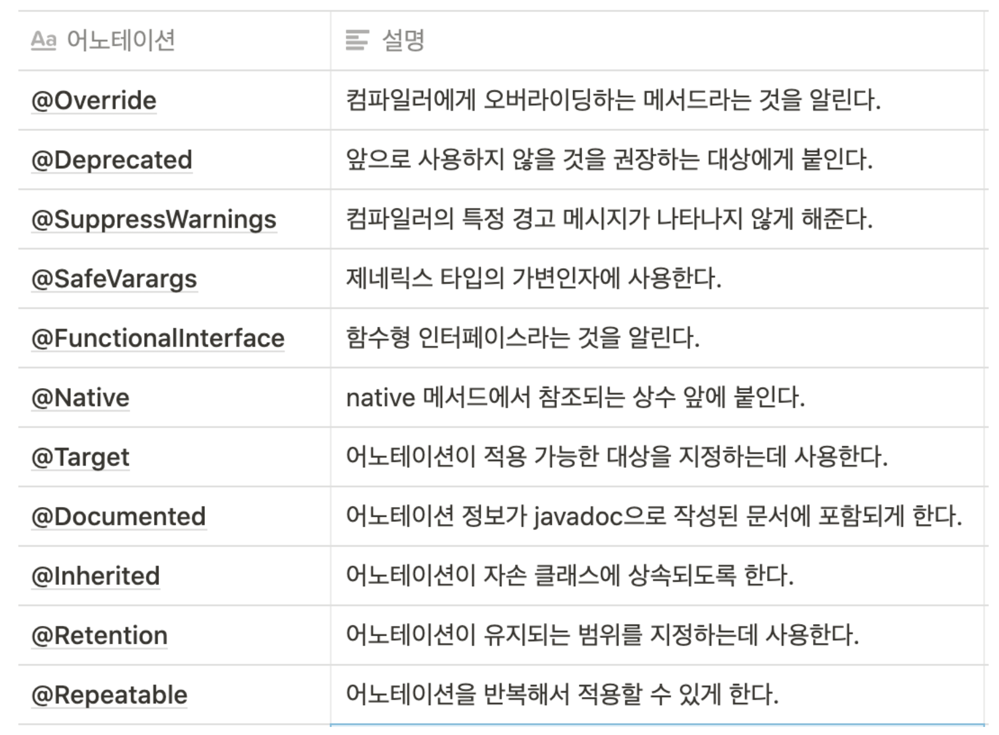

# Generics

지네릭스는 다양한 타입의 객체들을 다루는 메서드나 컬렉션 클래스의 컴파일 시의 타입 체크(compile - time type check)를 해주는 기능이다. 객체의 타입을 컴파일 시에 체크하기 때문에 객체의 타입 안정성을 높이고 형변환의 번거로움이 줄어든다.

## 지네릭 클래스의 선언

```java
class Box{
	Object item;

	void setItem(Object item) {this.item = item;}
	Object getItem() { return item;}
}
```

위와 같은 클래스가 있을 때 이를 지네릭 클래스로 변경하면 클래스 옆에 \<T>를 붙여주고 'Ojbect'를 모두 T로 바꾸면 된다.

```java
class Box<T>{
	T item;

	void setItem(T item) {this.item = item;}
	T getItem() { return item;}
}
```

무조건 T를 쓸 필요 없고, 다른 문자를 사용할 수 있다. 또한 Map처럼 타입 변수가 두개인 경우에는 Map<K, V>이런식으로 ',' 를 통해 구분이 가능하다.

위와 같이 지네릭 클래스를 선언하면 < >를 사용하여 타입을 지정할 수 있다.

```java
Box<String> b = new Box<String>();
b.setItem(new Object()); // 에러 발생 : 타입을 String으로 선언했기 때문
b.setItem("ABC"); // String 타입이므로 선언이 가능하다.
```

위와 같이 \<String>으로 선언을 하면 이는 지네릭 타입 T 대신에 String이 들어간 것과 같다.

## 지네릭스의 용어 및 제한

```java
class Box<T>{}
// Box<T> : 지네릭 클래스, T Box 라고 읽음
// T : 타입변수 또는 타입 매개변수(T는 타입 문자)
// Box : 원시 타입 (raw type)
```

지네릭 클래스는 모든 객체에 동일하게 동작해야하는 static멤버의 타입 변수 T를 사용할 수 없다.

- T또한 static멤버의 변수로 선언한다면 서로 다른 타입의 static 변수 선언시 문제 발생

지네릭 타입의 배열 변수를 선언하는 것이 불가하다. ex) new T[10] 불가

- new연산자 때문인데 new는 컴파일 시점에 타입 T가 무엇인지 알아야한다. 하지만 Box\<T>를 컴파일 하면 이때 T가 어떤 타입인지 정확히 알 수 없기 때문이다.
- 배열 대신 ArrayList를 사용해서 여러 객체를 저장할 수 있다.

## 지네릭 클래스의 객체 생성

아래의 예시를 보며 어떻게 사용하는지 쉽게 알 수 있다.

```java
import java.util.ArrayList;
class Fruite { public String toString() { return "Fruit"; }}
class Apple extends Fruit { public String toString() { return "Apple"; }}
class Grape extends Fruit { public String toString() { return "Grape"; }}
class Toy { public String toString() { return "Toy"; }}

class FruitBoxEx1{
	public static void main(String[] args){
		Box<Fruit> fruitBox = new Box<Fruit>();
		Box<Apple> appleBox = new Box<Apple>();
		Box<Toy> toyBox = new Box<Toy>();
		// Box<Grape> grapeBox = new Box<Apple>(); // 에러 타입 불일치

		fruitBox.add(new Fruit());
		fruitBox.add(new Apple()); // add함수가 Fruit item인 상태이기에 가능

		appleBox.add(new Apple());
		//appleBox.add(new Toy()); // 에러  Box<Apple>에는 Apple만 담을 수 있음

	}
	class Box<T>{
		ArrayList<T> list = new ArrayList<T>();
		void add(T item) { list.add(item); }
		T get(int i) { return list.get(i); }
		int size() { return list.size(); }
		public String toString() { return list.toString(); }
	}
}
```

- 지네릭클래스의 객체는 <타입>을 추가해주고 new 연산자를 통해 생성할 수 있다.
- 부모를 상속하여 구현한 클래스의 부모의 경우, 다형성에서 배운 것처럼 자식도 부모에 add할 수 있다.

## 지네릭 클래스와 extends, 와일드카드

### extends

지네릭 타입에 'extends'를 사용하면, 특정 타입의 자손들만 대입할 수 있게 제한할 수 있다.

```java
class FruitBox<T extends Fruit>{ // Fruit의 자손만 타입으로 지정가능
	ArrayList<T> list = new ArrayList<T>();
}
```

인터페이스를 구현해야 할 때 제약이 필요할 때도 extends를 사용한다.

```java
interface Eatable{}
class FruitBox<T extends Eatable> {...}
// 다음과 같이 & 연산자를 사용해서 여러 조건을 걸어줄 수 도 있다.
class FruitBox<T extends Fruit & Eatable> {...} //Fruit의 자손이면서 Eatable도 구현해야한다.
```

### 와일드카드

지네릭 타입이 다른 것만으로는 오버로딩이 성립하지 않는다
ex)

```java
static Juice makeJuice(FruitBox<Fruit> box){}

static Juice makeJuice(FruitBox<Apple> box){}
```

위의 두 함수는 지네릭 타입만 다르기 때문에 오버로딩이 성립하지 않아 컴파일 에러가 발생한다.

-> 따라서 이럴때 사용하기위해 고안된 것이 와일드 카드이며 '?'로 표현한다

```java
<? extends T> : 와일드 카드의 상한 제한. T와 그 자손들은 가능
<? super T> : 와일드 카드의 하한 제한. T와 그 조상들만 가능
<?> : 제한없이 모든 타입이 가능 <? extends Object>와 동일
```

### sort 함수와 와일드 카드

Collections.sort()의 선언부는 다음과 같다

```java
static <T> void sort(List<T> list, Comparator<? super T> c)
```

여기서 sort함수는 정렬할 방법이 정의된 Comparator가 있다. 클래스 Fruit를 상속한게 Apple, Grape라고 하면

```java
class AppleComp implements Comparator<Apple>{
	public int compare(Apple t1, Apple t2){
		return t2.weight - t1.weight;
	}
}
class GrapeComp implements Comparator<Grape>{
	public int compare(Grape t1, Grape t2){
		return t2.weight - t1.weight;
	}
}
```

위의 두 함수는 완전히 같지만, Fruit의 자손이 생길 때마다 위와 같은 코드를 반복해서 만들어야하는 불편함이 있다.
-> 다음과 같이 선언하면 자손이 생겨도 한번에 처리할 수 있다.

```java
class FruitComp implements Comparator<Fruit>{
	public int compare(Fruit t1, Fruit t2){
		return t1.weight - t2.weight;
	}
}
```

Comparator<? super Apple>, Comparator<? super Grape>로 되어있기 때문에 결국 Comparator에(sort함수의 두번째 파라미터에)Comparator<Apple>, Comparator<Fruit>, Comparator<Object>가 들어갈 수 있기 때문이다. 따라서 위와 같이 FruitComp 를 하나만 만들어주고 Apple, Grape에 넣어주면 코드의 주복을 방지할 수 있다.

## 지네릭 메서드

메서드의 선언부에 지네릭 타입이 선언된 메서드를 지네릭 메서드라고 한다.

- 앞에서 언급한 Collections.sort함수가 지네릭 메서드이다.
- 지네릭 클래스에 정의된 타입 매개변수와 지네릭 메서드에 정의된 타입 매개변수는 전혀 다른 별개의 값이다.
- static멤버에는 지네릭 타입 매개변수를 사용할수는 없지만, 메서드에 지네릭 타입으로 선언하는 것은 가능하다.
- 지네릭 메서드는 매개변수의 타입이 복잡할 때 유용하다.

```java
static juice makeJuice(FruitBox<? extends Fruit> box){
	return new juice();
};
// 위의 함수는 아래와 같이 쓸 수 있다.
static <T extends Fruit> juice makeJuice(FruitBox<T> box){
	return new juice();
};

/////////////////////////////////////////////////////////////////////////////

public static void printAll(ArrayList<? extends Product> list, ArrayList<? extends Product> list2){
	System.out.println("hi");
}
// 위의 복잡한 매개변수의 타입을 아래와 같이 변경이 가능하다.
public static <T extends Product> void printAll(ArrayList<T> list, ArrayList<T> list2){
	System.out.println("hi");
}
```

# 열거형(enums)

- 열거형은 서로 관련된 상수를 편리하게 선언하기 위한 것으로 여러 상수를 정의할 때 사용하면 유용하다.
- 자바의 열거형은 값 뿐만 아니라 타입도 체크하다 (typesafe enums)
  - 실제 값이 같아도 타입이 다르면 컴파일 에러가 발생한다.

```java
class Card{
	static final int CLOVER = 0;
	static final int HEART = 1;
	static final int DIAMOND = 2;
	static final int SPADE = 3;

	static final int TWO = -1;
	static final int THREE = 3;
	static final int FOUR = 2;

	final int kind;
	final int num;
}
// 위의 클래스를 아래와 같이 간단하게 줄일 수 있다.
class Card{
	enum Kind {CLOVER, HEART, DIAMOND SPADE}
	enum Num {TWO(-1), THREE(3), FOUR(2)}

	final Kind kind; // 타입이 int가 아니라 Kind이다
	final Num num;
}
```

열거형은 다음과 같은 함수들을 내장하고 있다.

```java
Class<E> getDeclaringClass() // 열거형의 Class객체를 반환한다.
String name() //열거형의 상수의 이름을 문자열로 반환한다.
int ordinal() // 열거형 상수가 정의된 순서를 반환한다
T valueOf(Class<T> enumType, String name) // 지정된 열거형에서 name과 일치하는 열거형 상수를 반환한다.
```

- 또한 열거형 상수간의 비교에는 '=='을 사용할 수 있다.
- '>', '<' 비교연산자는 compareTo()를 사용한다.
  - 비교대상이 같으면 0, 왼쪽이 크면 양수, 오른쪽이 크면 음수를 반환한다.

## 열거형의 이해

```java
enum Transportation{
    BUS(100) { int fare(int distance) { return distance*BASIC_FARE; }},
    TRAIN(100) { int fare(int distance) { return distance*BASIC_FARE; }},
    SHIP(100) { int fare(int distance) { return distance*BASIC_FARE; }},
    AIRPLANE(100) { int fare(int distance) { return distance*BASIC_FARE; }};


    protected final int BASIC_FARE; // private는 불가 public 은 가능
    Transportation(int basicFare){
        BASIC_FARE = basicFare;
    }
    public int getBasicFare(){ return BASIC_FARE; }
    // 열거형의 추상메서드
	abstract int fare(int distance); // 거리에 따른 요금 계산
}

public class EnumEx2 {
    public static void main(String[] args){
        System.out.println("bus fare="+Transportation.BUS.fare(100));
        System.out.println("train fare="+Transportation.TRAIN.fare(150));
        System.out.println("ship fare="+Transportation.SHIP.fare(100));
        System.out.println("airplane fare="+Transportation.AIRPLANE.fare(100));
    }
}

```

1. Transportation이라는 열거형의 변수 하나하나가 결국 Transportation 객체이다.
   - Transportation 생성자가 private로 자동으로 선언된 이유이다.
   - Transportation 생성자는 private로 선언되었기 때문에 new로 부를 수 없다.
2. enum의 추상메서드는 각 열거형 변수들이 각각 구현해야한다.
3. protected로 멤버변수(BASIC_FARE)를 선언하면 추상메서드에서 사용할 수 있다.

# 애너테이션(annotation)

애너테이션이란 프로그램의 소스코드안에 다른 프로그램을 위한 정보를 미리 약속된 형식으로 포함시킨 것이 바로 애너테이션이다. 애너테이션은 주석(comment)처럼 프로그래밍 언어에 영향을 미치지 않으면서도 다른 프로그램에게 유용한 정보를 제공할 수 있다.

## 표준 에너테이션

자바에서 기본적으로 제공하는 에너테이션이다.

<p align="center"></p>

### @Override

조상의 메서드를 오버라이딩 하는 것임을 컴파일러에게 알리는 역할을 한다.

- @Override 라고 애너테이션을 붙이면 컴파일러가 같은 이름의 메서드가 조상에 있는지를 확인하고 없으면 에러메시지를 출력한다.

### @Deprecated

- 앞으로 사용하지 않을 것을 권장하는 필드나 메서드에 붙여서 사용한다.
- @Deprecated가 붙은 대상을 사용하는 코드를 작성하면, 컴파일 시에 아래와 같은 메시지가 나타난다

```md
Note: \${@Deprecated 를 사용한 파일이름} uses or overrides a deprecated API.
Note: Recompile with -Xlint:deprecation for details
```

### @FunctionalInterface

함수형 인터페이스를 선언할 때 이 애너테이션을 붙이면 컴파일러가 직접 함수형 인터페이스를 올바르게 선언했는지 확인하고, 잘못된 경우 에러를 발생시킨다.

- 필수는 아니지만 함수형 인터페이스를 선언할 때 이 애너테이션을 붙이는것을 강력히 권장한다.

### SuppressWarnings

컴파일러가 보여주는 경고메시지가 나타나지 않게 억제해준다.

주로 사용되는 것은

- deprecation : @Deprecated가 붙은 대상을 사용해서 발생하는 경고 무시
- unchecked : 지네릭스로 타입을 지정하지 않았을때 발생하는 경고 무시
- rawtypes : 지네릭스를 사용하지 않아서 발생하는 경고 무시
- varags : 가변인자의 타입이 지네릭 타입일 때 발생하는 경고를 억제
  등 이다.

## 메타 애너테이션

메타 애너테이션은 '애너테이션을 위한 애너테이션'이다. 즉 애너테이션에 붙이는 애너테이션으로 애너테이션을 정의할 때 애너테이션의 적용대상(targe)이나 유지기간(retention)등을 지정하는데 사용된다.

- @Target : 어노테이션이 적용할 수 있는 대상을 지정한다
- @Retention : 애너테이션이 유지되는 기간을 지정한다.
- @Documented : 애너테이션의 대한 정보가 javadoc으로 작성한 문서에 포함되도록 한다.
- @Inherited : 애너테이션이 자손 클래스에도 상속되도록 한다.
- @Repeatble : 애너테이션을 반복해서 붙일 수 있도록 한다.

## 애너테이션 타입 정의하기

```java
@interface 이름 {
	타입 요소이름(); //애너테이션의 요소를 선언한다.
}
//@Override는 애너테이션이고, Override는 애너테이션의 타입이다.
```

@기호를 붙이는 것을 제외하면 인터페이스를 정의하는 것과 동일하다

에너테이션을 선언한 예시는 다음과 같다

```java
@interface TestInfo{
	int count();
	String testedBy();
	String[] testTools();
	TestType testType(); // enum TestType {FIRST, FINAL}
	DateTime testDate(); // 자신이 아닌 다른 애너테이션을 포함할 수 있다. @DateTime
}
@interface DateTime{
	String yymmdd();
	String hhmmss();
}

// 아래와 같이 애너테이션을 작성해서 사용한다
@TestInfo(
	count = 3,
	testedBy="Kim",
	testTools={"JUnit", "AutoTester"},
	testType=TestType.FIRST,
	testDate=@DateTime(yymmdd="160101", hhmmss="235959")
)
public class myClass{
 ...
}
```

# Reference

- 남궁성, Java의 정석 (3rd Edition), 도우출판
- annotation 사진 출처 : https://velog.io/@gkskaks1004/%EC%96%B4%EB%85%B8%ED%85%8C%EC%9D%B4%EC%85%98
