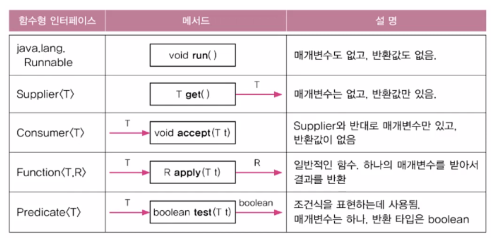
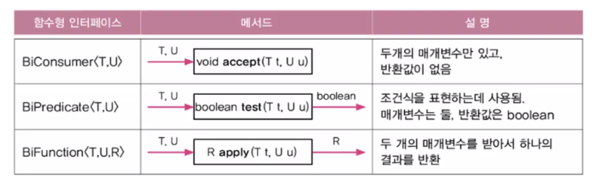
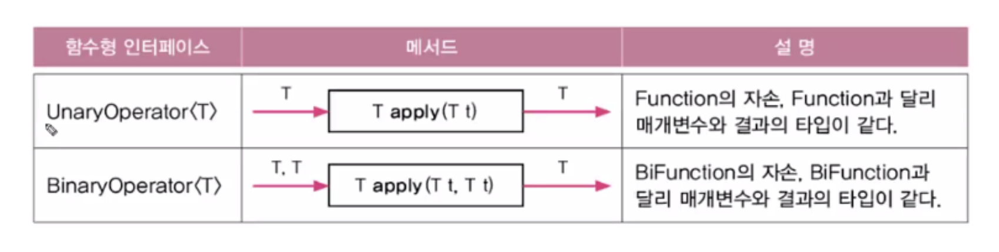
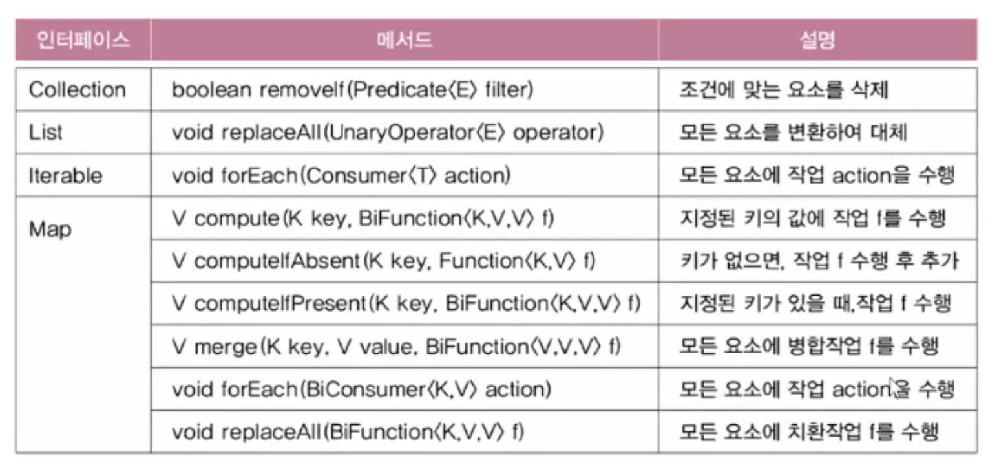
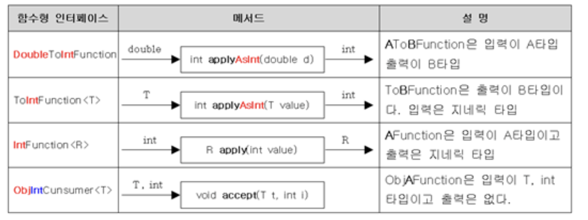

# 람다식(Lambda expression)

람다식(Lambda expression)은 JDK 1.8 부터 추가되었다. 람다식은 메서드를 하나의 '식(expression)'으로 표현한 것이다.

- 람다식을 함수를 간략하고 명확하게 표현할 수 있다 -> 가독성에 좋다
- 람다식을 '익명 함수(anonymous function)' 이라고도 한다
- 모든 메서드는 클래스에 포함되어야 하지만, 람다식은 이 과정이 필요없이 오직 람다식 자체만으로 메서드의 역할을 대신할 수 있다.

```java
반환타입 메서드이름(매개변수 선언){
    문장들
}
/// 위의식은 람다식으로 하면 아래처럼 바뀐다.
(매개변수 선언) ->{
    문장들
}

// ex
(int a, int b) -> {return a > b ? a : b ;}
// 리턴문이 들어가 있으므로 문장(statement)이기 때문에 ;가 있어야한다, return이 있을경우 {}를 생략 불가
(int a, int b) -> a > b ? a : b
// return문이 없는 식이므로 ; 가 필요 없다
(a, b) -> a > b ? a : b
// 람다식에서 선언된 매개변수의 타입은 추론 가능할 경우 생략 가능하다.
```

## 함수형 인터페이스 (Functional Interface)

사실 람다식은 익명 클래스의 객체와 동등하다

```java
(int a, int b) -> a > b ? a : b;
// 위의 식은 아래와 동일하다.
new Object(){
    int max(int a, int b){
        return a > b ? a : b;
    }
}
```

따라서 람다식에서 참조변수의 타입은 클래스 또는 인터페이스만 가능하다.

하나의 메서드가 선언된 인터페이스를 정의해서 람다식을 다룬다. 이를 위한 인터페이스를 `함수형인터페이스`라고 한다.

```java
@FunctionalInterface
interface MyFunction{ // 함수형 인터페이스 MyFUnction을 정의
    public abstract int max(int a, int b);
}
```

- 함수형 인터페이스에는 오직 하나의 추상 메서드만 정의되어 있어야 하는 제약이 있다.
- static메서드와 default메서드의 개수에는 제약이 없다.

## java.util.function 패키지

java.util.function패키지에는 일반적으로 자주 쓰이는 형식의 메서드를 함수형 인터페이스로 미리 정의해 놓았다. 가능하면 이 패키지의 인터페이스를 활용하는 것이 좋다.

<p align="center"></p>

## Predicate : 조건식 표현에 사용

- Predicate는 Function의 변형으로, 반환타입이 boolean이라는 것만 다르다.
- Predicate는 조건식을 람다식으로 표현하는데 사용된다.

```java
Predicate<String> isEmptyStr = s -> s.length() == 0;
String s = "";
if(isEmptyStr.test(s)) // if(s.length == 0)
    System.out.println("This is an emtpy String.");
```

## 접두사 Bi : 매개변수가 두 개인 함수형 인터페이스

<p align="center"></p>
이후 두개 이상의 매개변수를 갖는 함수형 인터페이스가 필요하다면 직접 만들어서 써야한다.
```java
@FunctionalInterface
interface TriFunction<T, U, V, R>{
    R apply(T t, U u, V v);
}
```

## UnaryOperator와 BINaryOperator

Function의 또 다른 변형으로 매개변수의 타입과 반환타입이 모두 일치할 경우 사용한다.

<p align="center"></p>

## 컬렉션 프레임웍과 함수형 인터페이스

아래 표는 컬렉션 프레임웍에서 인터페이스에 함수형 인터페이스를 사용하는 메서드들의 목록이다.

<p align="center"></p>
아래와 같은 방법으로 사용한다

```java
import java.util.*;
public class LambdaEx4 {
    public static void main(String[] args){
        ArrayList<Integer> list = new ArrayList<>();
        for (int i = 0; i < 10; i++) list.add(i);

        list.forEach(i -> System.out.println(i + ","));
        System.out.println();

        list.removeIf(x -> x % 2 == 0 || x % 3 == 0);
        System.out.println(list);

        list.replaceAll(i -> i * 10);
        System.out.println(list);

        Map<String, String> map = new HashMap<>();
        map.put("1", "1");
        map.put("2", "2");
        map.put("3", "3");
        map.put("4", "4");

        map.forEach((k, v) -> System.out.println("{" + k + "," + "},"));
        System.out.println(list);
    }
}

```

## 기본형을 사용하는 함수형 인터페이스

기본갑을 사용할 때도 대부분 래퍼(wrapper)클래스를 사용해왔다. 하지만 더 효율적으로 처리하기 위해 기본형을 ㅏㅅ용하는 함수형 인터페이스들이 있다.

<p align="center"></p>

## Function의 합성과 Predicate의 결합

java.util.function패키지의 함수형 인터페이스에는 추상메서드 외에도 디폴트 메서드와 static메서드들이 있다.

```java
// Function
default <V> Function<T, V> andThen (Function<? super R, ? extends V> after)
// f.andThen(g) : f이후에 그 결과로 g 실행
default <V> Function<V, R> compose (Function<? super V, ? extends T> before)
// f.compose(g) : g실행이후에 그결과로 f실행
static <T> Function<T, T> indetity()
// 항등함수
// Predicate
default Predicate<T> and(Predicate<? super T> other)
default Predicate<T> or(Predicate<? super T> other)
default Predicate<T> negate()
static <T> Predicate<T> isEqual(Object targetRef)
// Predicate<Integer> all = notP.and(q.or(r));
```

## 메서드 참조

람다식이 하나의 메서드만 호출하는 경우에는 `메서드참조(method reference)`라는 방법으로 람다식을 간략하게 할 수 있다.

```java
// ex1
Function<String, Integer> f = (String s) -> Integer.parseInt(s);
// 위의 식으로 람다식을 간략하게 할 수 있다.
Function<String, Integer> f = Integer::parseInt;

// ex2
BiFunction<String, String, Boolean> f = (s1, s2) -> s1.equals(s2);
// 위의 식으로 람다식을 간략하게 할 수 있다.
BiFuction<String, String, Boolean> f = String::equals;
```

즉 하나의 메서드만 호출하는 람다식은 `클래스이름::메서드이름`또는`참조변수::메서드이름`으로 바꿀 수 있다.

# Reference

- 남궁성, Java의 정석 (3rd Edition), 도우출판
- 함수형 인터페이스 사진 : https://velog.io/@oyeon/14-78-java.util.function-%ED%8C%A8%ED%82%A4%EC%A7%80
