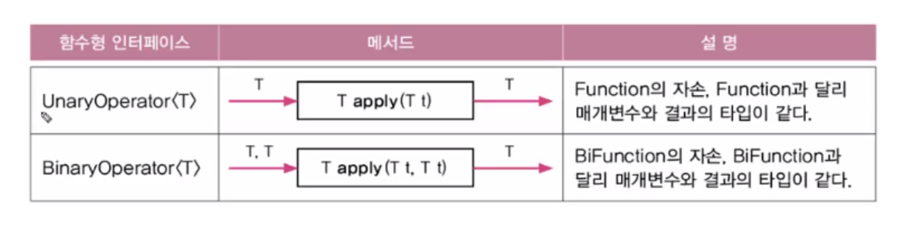
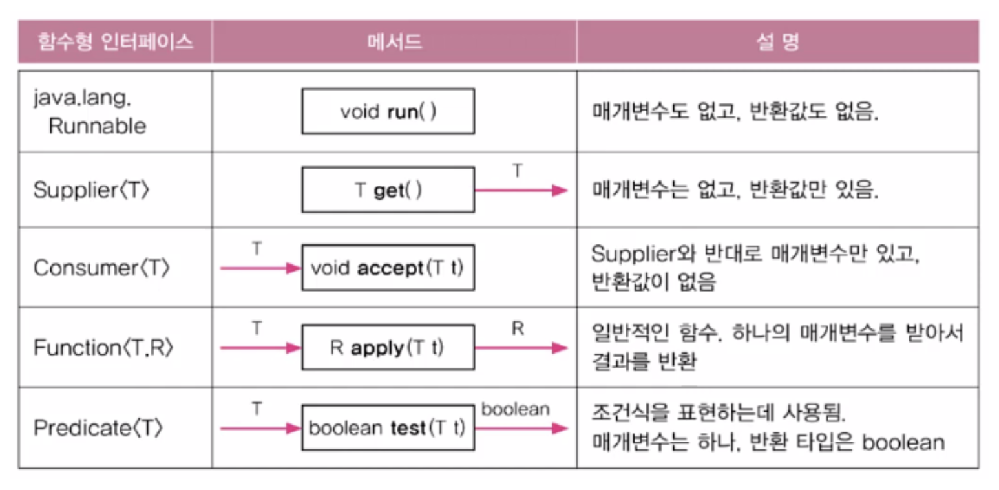
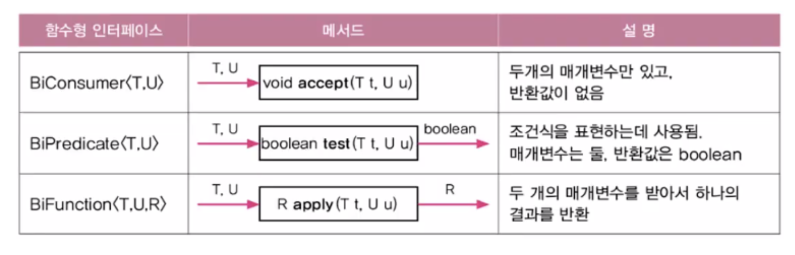

# 프로세스와 쓰레드

프로세스(process)는 **실행중인 프로그램(program)**이다.

- 프로그램을 실행하면 OS로부터 실행에 필요한 자원(메모리)을 할당받아 프로세스가 된다.
- 프로세스는 프로그램을 수행하는데 필요한 데이터와 메모리 등의 자원 그리고 쓰레드로 구성되어 있다.

**프로세스를 작업공간(공장)**이라고 하면 쓰레드는 **작업을 처리하는 일꾼(worker)**로 생각하면 된다.

- 모든 프로세스에는 최소한 하나 이상의 쓰레드가 존재하며 둘 이상의 쓰레드를 가진 프로세스를 멀티쓰레드 프로세스 라고 한다.
- 쓰레드의 개수는 제한이 없으나 쓰레드가 작업을 수행하는데에는 개별적인 메모리 공간(호출스택)이 필요하다.
- 프로세스의 메모리 한계에 따라 생성할 수 있는 쓰레드의 수가 결정된다.

### 멀티태스킹과 멀티쓰래딩

- 멀티태스킹 : 여러개의 프로세스가 동시에 실행되는 것

- 멀티쓰래딩 : 프로세스 내에서 여러 쓰레드가 동시에 작업을 수행하는 것

  - CPU의 코어가 한번의 하나의 작업만 수행 가능하므로 동시의 처리되는 작업의 개수는 코어의 개수와 일치한다.

        		-> 아주 짧은 시간동안 여러 작업을 번갈아 가며 수행하면서 여러 작업들이 동시해 수행하는 것처럼 보이게 한다.

# 쓰레드의 구현과 실행

1. Thread 클래스를 상속

```java
class MyThread extends Thread{
	public void run() {
		//작업내용 // Thread클래스의 run()을 오버라이딩 해서 사용한다.
	}
}
```

2. Runnable 인터페이스를 구현

```java
class myTread implements Runnable{
	public void run(){
		// 작업내용 // Runnable 인터페이스의 run()을 구현
	}
}
```

두가지 방법이 있지만 Thread클래스를 상속받으면 다른 클래스를 상속받을 수 없기 때문에 Runnable 인터페이스를 구현하는 방법이 일반적이며 보다 객체지향적인 방법이다.

결국에 쓰래드를 구현한다는 것은 쓰래드를 통해 작업하고자하는 내용으로 사용되는 run()함수를 구현하는 것이다.

### Runnable interface를 구현한 Thread의 정보

Thread를 extend하여 구현하면 Thread클래스의 메서드를 직접호출 할 수 있지만 Runnable을 구현하여 사용할 경우 currentTread()를 호출하여 쓰레드에 대한 참조를 받아와야 한다.

```java
static Thread currentThread() //현재 실행중인 쓰레드의 참조를 반환한다.
String getName() // 쓰레드의 이름을 반환한다.

// 따라서 다음과 같이 사용해서 현재 실행중인 쓰래드의 이름을 파악한다.
Thread.currentTread().getName();
```

아래 예시는 사용에 대한 차이를 보여준다.

```java
class ThreadEx1_1 extends Thread{
	public void run(){
		for(int i=0; i<5; i++){
			System.out.println(getName());
		}
	}
}

class ThreadEx1_2 implements Runnable{
	public void run(){
		for(int i=0; i<5; i++){
			//Thread.currentThread() - 현재 실행중인 Thread를 반환한다.
			System.out.println(Thread.currentTread().getName());
		}
	}
}
```

## 쓰레드의 실행 - start()

start()는 새로운 쓰레드가 작업을 실행하는데 필요한 호출스택(call stack)을 생성한 다음에 run()을 호출해서, 생성된 호출 스택에 run()이 첫번째로 올라가게 한다.

- 한번 실행이 종료된 쓰레드는 다시 실행 할 수 없다.
- 스케줄러는 실행 대기중인 쓰레드들의 우선순위를 고려하여 실행 순서와 실행 시간을 결정한다.

### main쓰레드

메인 메서드의 작업을 수행하는 것도 결국 쓰레드이며 이를 main쓰레드라고 한다.

> 실행 중인 사용자 쓰레드가 하나도 없을 떄 프로그램은 종료 된다.

- main 쓰레드가 종료되더라도, 다른 쓰레드가 아직 작업을 마치지 않은 상태라면 프로그램이 종료되지 않는다.
- 한 쓰레드가 예외가 발생해서 종료되어도 다른 쓰레드의 실행에는 영향을 미치지 않는다.

# 싱글쓰레드와 멀티쓰레드

멀티쓰레드로 작업을 하면 쓰레드간의 작업 전환(context switching)이 발생하기 때문에 서로 다른 자원을 사용하는 작업의 경우 멀티쓰레드를 사용하는것이 싱글쓰레드를 사용하는 것보다 더 효율적이다.

- ex) 사용자로부터 데이터를 입력받는 작업, 네트워크로 파일을 주고받는 작업 등

쓰레드를 생성하며 사용자의 입력을 받는 예제는 아래와 같다.

```java
import javax.swing.*;

public class ThreadEx2 {
    public static void main(String[] args) throws Exception{
        ThreadEx22 th1 = new ThreadEx22();
        th1.start();

        String input = JOptionPane.showInputDialog("아무값이나 입력하세요.");
        System.out.println("입력하신 값은: " + input + "입니다.");
    }
}

class ThreadEx22 extends Thread{
    public void run(){
        for(int i=10; i>0; i--){
            System.out.println(i);;
            try{
              sleep(1000);
            }
            catch(Exception e){}
        }
    }
}
```

위의 예시처럼 사용자에게 입력을 받는 input의 기능을 하는 main쓰레드가 있고, 초를 세주는 ThreadEx22가 있다.

# 쓰레드의 우선순위

쓰레드는 우선순위(priority)라는 속성(멤버변수)를 가지고 있는데 우선순위의 값에 따라 쓰레드가 얻는 실행시간이 달라진다.

- 시각적인 부분이나 사용자에게 빠르게 반응해야하는 작업의 쓰레드의 우선순위를 높게 설정해야한다.

다음과 같은 방법으로 우선순위를 정할 수 있다.

```java

void setPriority(int newPriority) // 쓰레드의 우선순의를 지정한 값으로 변경한다.
int getPriority() // 쓰레드의 우선순위를 반환한다.

public static final int MAX_PRIORITY = 10;
public static final int MIN_PRIORITY = 1;
public static final int NORM_PRIORITY = 5;
```

- 쓰레드의 우선순위는 최소 1, 최대 10 까지 가지며 main메서드의 쓰레드는 우선순위가 5이다.
- 쓰레드의 우선순위는 쓰레드를 생성한 쓰레드로부터 상속받는다.
- 쓰레드를 생성하기 전에만 우선순위를 변경할 수 있다.

# 쓰레드 그룹

쓰레드 그룹은 서로 관련된 쓰레드를 그룹으로 다루기 위한 것이다. 폴더처럼 쓰레드 그룹을 생성해서 관련있는 쓰레드를 그룹으로 묶어서 관리할 수 있다.

- 쓰레드 그룹은 자신이 속한 쓰레드 그룹이나 하위 쓰레드 그룹은 변경 가능하다.
- 쓰레드 그룹은 다른 쓰레드 그룹의 쓰레드를 변경할 수 없다.
- 모든 쓰레드는 반드시 쓰레드 그룹에 포함되어 있다 (따로 선언하지 않을 시 main 쓰레드 그룹에 속한다 )
- 우리가 생성하는 모든 쓰레드 그룹은 main쓰레드 그룹의 하위 쓰레드 그룹이 된다.
- system 쓰레드 그룹은 가비지 컬렉션을 실행한느 Finalizer쓰레드가 포함되어 있다.

```java
public class ThreadEx3 {
    public static void main(String[] args) throws Exception{
        ThreadGroup main = Thread.currentThread().getThreadGroup();
        ThreadGroup grp1 = new ThreadGroup("Group1");
        ThreadGroup grp2 = new ThreadGroup("Group2");

        //ThreadGroup(ThreadGroup parent, String name);
        ThreadGroup subGrp1 = new ThreadGroup(grp1, "SubGroup1");

        grp1.setMaxPriority(3); //쓰레드 그룹 grp1의 최대우선순의를 3으로 변경

        Runnable r = new Runnable() {
            @Override
            public void run() {
                try{
                    Thread.sleep(1000);
                } catch (InterruptedException e) {}
            }
        };

        // Thread(ThreadGroup tg, Runnable r, String name);
        new Thread(grp1, r, "th1").start();
        new Thread(subGrp1, r, "th2").start();
        new Thread(grp2, r, "th3").start();

        System.out.println(">>List of ThreadGroup : " + main.getName() + "" +
                ", Active Thread Group: " + main.activeGroupCount() + ", Active Thread: " + main.activeCount());
        main.list();
    }
}

```

- 기존에 만들어진 group을 인자로 넣어 subGroup(자손)도 만들 수 있다.
- setMaxPriority()함수를 이용하여 쓰레드 그룹의 우선순위를 변경해줄 수 있다.

# 데몬 쓰레드 (daemon thread)

데몬 쓰레드는 다른 일반 쓰레드(데몬 쓰레드가 아닌 쓰레드)의 작업을 돕는 보조적인 역할을 수행하는 쓰레드이다. 데몬쓰레드는 **무한루프와 조건문**을 이용해서 실행 후 대기하고 있다가 특정 조건이 만족되면 작업을 수행하고 다시 대기하도록 작성한다.

- 데몬쓰레드는 보조역할이므로 일반 쓰레드가 모두 종료되고 나면 데몬 쓰레드는 강제적으로 자동종료된다.
- ex) 가비지 컬렉터, 화면 자동갱신 등

```java
boolean isDaemon() // 쓰레드가 데몬 쓰레드인지 확인한다. 데몬쓰레드이면 true를 반환한다.
void setDaemon(boolean on)
// 쓰레드를 데몬쓰레드로 또는 사용자 쓰레드로 변경이 가능하다. on을 true로하면 데몬 쓰레드가 된다.
// start()를 호출하기 전에 실행되어야만 한다.
```

아래 예시는 데몬 쓰레드에 관한 예시이다. 보다시피 데몬쓰레드는 대기하고 있다가 autoSave의 조건이 걸리면 이제 지정해둔 활동을 진행한다.

```java
public class ThreadEx4 implements Runnable{
    static boolean autoSave = false;
    public static void main(String[] args){
        Thread t = new Thread(new ThreadEx4());
        t.setDaemon(true);
        t.start();

        for(int i=1; i<=10; i++){
            try{
                Thread.sleep(1000);
            }catch(InterruptedException e){}
            System.out.println(i);
            if(i == 5) autoSave = true;
        }
    }
    public void run(){
        while(true){
            try{
                Thread.sleep(3 * 1000); //3초마다
            }catch (InterruptedException e ){}
            // autoSave가 true이면 해당 함수를 호출
            if(autoSave){
                autoSave();
            }
        }
    }
    public void autoSave(){
        System.out.println("작업파일이 자동저장되었습니다.");
    }
}

```

# 쓰레드의 실행제어

쓰레드 프로그래밍이 어려운 이유는 동기화(synchronization)와 스케줄링(scheduling)때문이다. 이를 잘 하기 위해서 아래와 같은 함수들의 사용법을 잘 익혀야 한다.

<p align="center"></p>

## 쓰레드의 상태

관련 함수들을 알아보기 전에 쓰레드의 상태에 대해서 먼저 알아야한다. 쓰레드는 다음 표의 나온 것처럼 5개의 상태로 나뉜다.

<p align="center"></p>

또한 쓰레드의 생성부터 소멸까지의 과정을 그린 그림으로 이제 앞으로 사용할 쓰레드의 동기화 및 스케쥴링을 위한 함수들이 실행하면 실제로 쓰레드가 어떤 상태가 되는지를 보여준다.

<p align="center"></p>

```
1.쓰레드를 생성하고 start()를 호출하면 바로 실행되는 것이 아니라 실행 대기열에 저장되어 자신의 차례가
될 때 까지 기다려야한다. 실행대기열은 큐와 같은 구조로 먼저 실행대기 열에 들어온 쓰레드가 먼저 실행된다.

2.실행대기상태에 있다가 자신의 차례가 되면 실행 상태가 된다.

3.주어진 실행시간이 다되거나 yield()를 만나면 다시 실행대기상태가 되고 다음 차례의 쓰레드가 실행상태가 된다.

4.실행중에 suspend(), sleep(), wait(), join(), I/O block에 의해 일시정지상태가 될 수 있다.
I/O block은 입출력작업에서 발생하는 지연상태를 말한다. 사용자의 입력을 기다리는 경우를 예로 들 수 있는데,
이런 경우 일시정지 상태에 있다가 사용자가 입력을 마치면 다시 실행대기 상태가 된다.

5.지정된 일시정지시간이 다되거나 notify(), resume(), interrupt()가 호출되면 일시 정지상태를 벗어나
다시 실행대기열에 저장되어 자신의 차례를 기다리게 된다.

6.실행을 모두 마치거나 stop()이 호출되면 쓰레드는 소멸된다.
```

## sleep(long millis)

sleep()은 일정 시간동안 쓰레드를 멈추게 한다.

```java
static void sleep(long millis)
static void sleep(long millis, int nanos)
```

단 sleep을 호출할 때는 항상 try-catch문으로 예외처리를 해줘야 하므로 아래와 같이 try-catch까지 포함하는 메서드를 만들어서 사용하기도 한다.

```java
void delay(long millis){
	try{
		Thread.sleep(millis);
	} catch(InterruptedException e){}
}
```

sleep() 메서드는 항상 현재 실행 중인 쓰레드에 대해 작동하기 때문에 th1.sleep(2000)이런식으로 해도 결국엔 현재 실행중인 쓰레드를 sleep하는 것이 된다. 따라서 sleep메서드는 Thread.sleep(2000); 처럼 써 줘야한다.

## interrupt()와 interrupted()

진행중인 쓰레드의 작업이 끝나기 전에 취소시켜야 할 때 사용한다.

```java
void interrupt() // 쓰레드의 interrupted 상태를 false에서 true로 변경
void isInterrupted() // 쓰레드의 interrupted 상태를 반환
static boolean interrupted() // 현재 쓰레드의 interrupted상태를 반환 후, false로 변경
```

interrupt()를 호출하면 sleep(), wait(), join()에서 InterruptedException이 발생하고 해당 쓰레드는 '실행대기 상태(RUNNALBE)' 로 바뀐다.

```java
import javax.swing.*;

public class ThreadEx5 {
    public static void main(String[] args) throws Exception{
        ThreadEx14_1 th1 = new ThreadEx14_1();
        th1.start();

        String input = JOptionPane.showInputDialog("아무값이나 입력하세요.");
        System.out.println("입력하신 값은 " + input + "입니다.");;
        th1.interrupt(); // interrupt()를 호출하면, interrupted상태가 true가 된다.
        System.out.println("isInterrupted(): " + th1.isInterrupted());
    }
}
class ThreadEx14_1 extends Thread{
    public void run(){
        int i= 10;
        while(i !=0 && !isInterrupted()){
            System.out.println(i--);
            try{
                Thread.sleep(1000); //1초 지연
            }catch (InterruptedException e) {
                // sleep함수가 돌고있는 tryCatch문에 interrupt가 발생하면
				// InterruptedException이 발생하여 쓰레드의
				// Interrupt 상태는 false로 자동 초기화 된다. 따라서 이를 막기위해 아래에 interrupt를 추가

				interrupt();
				// interrupt함수를 발생시켜서 다시 interrupted의 상태를 true로 바꿔주어야한다.
            }
        }
        System.out.println("카운트가 종료되었습니다.");
    }
}

```

다음과 같은 방법으로 interrupt가 발생했을 쓰레드가 sleep(1000)함수에 빠져있는 상태라면 이를 탈출하며 Interrupt의 상태가 다시 false로 자동 초기화 된다. 하지만 이번 예제의 경우 interrupt가 발생하면 종료해야하기 때문에 catch문에 다시 interrupt()를 넣어 thread가 종료되도록 만들었다.

## suspend(), resume(), stop()

suspend()는 sleep()처럼 쓰레드를 멈추기 한다. suspend()에 의해 정지된 쓰레드는 resume()을 호출해야 다시 실행대기 상태가 된다. stop()은 호출되는 즉시 쓰레드가 종료된다.

하지만 이 메서드들은 모두 'deprecated' 되었다. 따라서 이 메서드들은 다음과 같이 오버라이딩 하여 사용한다.

```java
public class ThreadEx6 {
    public static void main(String[] args){
        ThreadEx17_1 th1 = new ThreadEx17_1("*");
        ThreadEx17_1 th2 = new ThreadEx17_1("**");
        ThreadEx17_1 th3 = new ThreadEx17_1("***");
        th1.start();
        th2.start();
        th3.start();

        try{
            Thread.sleep(2000);
            th1.suspend();
            Thread.sleep(2000);
            th2.suspend();
            Thread.sleep(3000);
            th1.resume();
            Thread.sleep(3000);
            th1.stop();
            th2.stop();
            Thread.sleep(2000);
            th3.stop();
        }catch (InterruptedException e){}
    }
}
class ThreadEx17_1 implements Runnable{
    boolean suspended = false;
    boolean stopped = false;

    Thread th;

    ThreadEx17_1(String name){
        th = new Thread(this, name); // Thread(Runnable r, String name);
    }

    public void run(){
        while(!stopped){ // stopped 값이 false인 동안 반복한다
            if(!suspended){ // suspended의 값이 false일 떄만 작업을 수행한다.
                System.out.println(Thread.currentThread().getName());
                try{
                    Thread.sleep(1000);
                }catch(InterruptedException e){}
            }
        }
        System.out.println(Thread.currentThread().getName() + " - stopped");
    }
    // 이렇게 오버라이딩해서 사용하기
    public void suspend() {suspended = true; }
    public void resume() {suspended = false; }
    public void stop() {stopped = true; }
	//  suspend, stop에 th.interrupt()를 넣어주면 sleep(1000)에 걸려있던 상태에서 바로 탈출할 수 있다.
    public void start() {th.start();}
}

```

## yield()

yield()는 쓰레드 자신에게 주어진 실행시간을 다음 차례의 쓰레드에게 양보한다.

yield()와 interrupt()를 적절히 사요하면 프로그램의 응답성을 높이고 보다 효율적인 실행이 가능하게 할 수 있다.

바로 위에 코드 예제에서 다음과 같은 것들을 추가하면 조금 더 효율적으로 바꿀수 있다.

```java
while(!stopped){
            if(!suspended){
                System.out.println(Thread.currentThread().getName());
                try{
                    Thread.sleep(1000);
                }catch(InterruptedException e){}
            }
        }
// 위의 코드를 yield를 추가하면 의미없이 while문을 도는 낭비(busy-waiting)를 없앨 수 있다.

while(!stopped){
            if(!suspended){
                System.out.println(Thread.currentThread().getName());
                try{
                    Thread.sleep(1000);
                }catch(InterruptedException e){}
            }
			else{
				Thread.yeild(); //해당 쓰레드가 쓰도록 할당된 시간을 양보하기 떄문이다.
			}
        }
```

## join()

쓰레드 자신이 하던 작업을 잠시 멈추고 다른 쓰레드가 지정된 시간동안 작업을 수행하도록 할때 join()을 사용한다

```java
void join()
void join(long millis)
void join(long millis, int nanos)
```

join()도 sleep()처럼 interrupt()에 의해 대기상태에서 벗어날 수 있으며 join()이 호출되는 부분을 try-catch로 감싸야 한다. 단 join()은 현재 쓰레드가 아닌 특정 쓰레드에 대해 동작하므로 static 메서드가 아니다.

```java
public class ThreadEx7 {
    public static void main(String[] args){
        ThreadEx20_1 gc = new ThreadEx20_1();
        gc.setDaemon(true);
        gc.start();

        int requiredMemory = 0;
        for(int i=0; i<20; i++){
            requiredMemory = (int)(Math.random() * 10) * 20;
            // 필요한 메모리가 사용할 수 있는 양보다 크거나 전체메모리의 60%이상을 사용했을 경우 gc를 꺠운다.
            if(gc.freeMemory() < requiredMemory || gc.freeMemory() < gc.totalMemory() * 0.4){
                gc.interrupt();
                // gc 가 작업할 시간을 기다리는 것
                try{
                    gc.join(100);
					// join을 이용해서 gc가 작업을 할 시간을 0.1초 정도 주는 것
					// 이를 통해 데이터가 꼬이는 것을 방지할 수 있다.
                }catch(InterruptedException e){}
            }
            gc.usedMemory += requiredMemory;
            System.out.println("usedMemory: "+ gc.usedMemory);
        }
    }
}
class ThreadEx20_1 extends Thread{
    final static int MAX_MEMORY = 1000;
    int usedMemory = 0;
    public void run(){
        while(true){
            try{
                Thread.sleep(10 * 1000); //10초를 기다린다.
            }catch (InterruptedException e){
                System.out.println("Awaken by Interrupt().");
            }
            gc();//garbage collection을 수행한다.
            System.out.println("Garbage Collected. Free Memory :" + freeMemory());
        }
    }
    public void gc(){
        usedMemory -= 300;
        if(usedMemory < 0) usedMemory = 0;
    }
    public int totalMemory() { return MAX_MEMORY; }
    public int freeMemory() { return MAX_MEMORY - usedMemory; }
}

```

# 쓰레드의 동기화

한 쓰레드가 진행 중인 작업을 다른 쓰레드가 간섭하지 못하도록 막는 것을 쓰레드의 동기화(synchronization)라고 한다.

- 임계영역 : 공유 데이터를 사용하는 코드 영역을 임계 영역이라 지정해 놓는다. 쓰레드가 임계 영역 내로 접근하면 lock을 얻어야지만 임계 영역의 코드를 수행할 수 있게 된다.
- lock : lock을 획득한 단 하나의 쓰레드만 이 영역 내의 코드를 수행 할 수 있게 한다. 또한 코드를 모두 수행하고 임계 영역을 벗어나면 lock을 자동으로 반납한다.

## synchronized

1. 메서드 전체를 임계영역으로 지정

```java
public synchronized void caclSum(){
	//...
}
```

2. 특정한 영역을 임계영역으로 지정

```java
synchronized(객체의 참조변수 (ex: this)){
	//...
}
```

- 쓰레드는 synchronized메서드가 호출된 시점부터 해당 메서드가 포함된 객체의 lock을 얻어 작업을 수행하다가 메서드가 종료되면 lock을 반환한다.
- 임계영역은 멀티쓰레드 프로글매의 성능을 좌우하기 때문에 synchronized를 최소화(임계영역을 최소화)해서 보다 효율적인 프로그램을 만들 수 있도록 노력해야 한다.

## wait()와 notify()

synchronized로 동기화하여 공유데이터를 보호할 수 있지만, 특정 쓰레드가 객체의 락을 가진 상태로 오랜 시간을 보내지 않도록 하는 것도 중요하다.

wait(), notify\*(), notifyAll()은 동기화 블록(synchronized블록)내에서만 사용 가능하다.

- wait() : 해당 쓰레드가 락을 반납하고 기다리도록 만든다.
  - 매개변수가 있는 wait는 지정된 시간동안만 기다린다. 즉 지정된 시간이 지난 후에 자동적으로 notify()가 호출되는 것과 같다.
- notify() : 작업을 중단했던 쓰레드가 다시 락을 얻어 작업을 진행할 수 있도록 한다.
  - notify()는 임의의 쓰레드에게 통보하기 때문에 lock을 받을 수 있는 것은 대기하고 있던 임의의 한 쓰레드이다.
- notifyAll() : 기다리고 있는 모든 쓰레드에게 통보를 한다. 그러나 마찬가지로 한 스레드만 lock을 받을 수 있따.

```java
import java.util.ArrayList;

public class ThreadWaitEx1 {
    public static void main(String[] args) throws  Exception{
        Table table = new Table(); //여러 쓰레드가 공유하는 객체

        new Thread(new Cook(table), "COOK1").start();
        new Thread(new Customer(table, "donut"), "CUST1").start();
        new Thread(new Customer(table, "burger"), "CUST2").start();

        Thread.sleep(5000);
        System.exit(0);
    }
}

class Customer implements Runnable{
    private Table table;
    private String food;

    Customer(Table table, String food){
        this.table = table;
        this.food = food;
    }
    public void run(){
        while(true){
            try{Thread.sleep(10);} catch (InterruptedException e){}
            String name = Thread.currentThread().getName();

            table.remove(food);
            System.out.println(name + " ate a " + food);
        }
    }

}

class Cook implements Runnable{
    private Table table;

    Cook(Table table){ this.table = table; }
    public void run(){
        while(true){
            int idx = (int)(Math.random()* table.dishNum());
            table.add(table.dishNames[idx]);
            try{Thread.sleep(1); } catch(InterruptedException e){}
        }
    }
}

class Table{
    String[] dishNames = {"donut", "donut", "burger"};
    final int MAX_FOOD = 6;

    private ArrayList<String> dishes = new ArrayList<>();

    public synchronized void add(String dish){
        while(dishes.size() >= MAX_FOOD){
            String name = Thread.currentThread().getName();
            System.out.println(name + " is waiting.");
            try{
                wait(); // COOK 쓰레드를 멈추게한다 -> 이미 요리가 가득차 있기 떄문이다.
                Thread.sleep(500);
            } catch(InterruptedException e){}
        }
        dishes.add(dish);
        notify(); // 기다리고 있는 CUST를 깨운다.
        System.out.println("Dishes:" + dishes.toString());
    }

    public void remove(String dishName){
        // 지정된 요리와 일치하는 요리를 테이블에서 제거한다
        synchronized (this){
            String name = Thread.currentThread().getName();

            while(dishes.size() == 0){
                System.out.println(name+ " is waiting.");
                try{
                    wait(); // CUST쓰레드를 기다리게한다.
                    Thread.sleep(500);
                } catch (InterruptedException e){}
            }
            while(true){
                for(int i=0; i< dishes.size(); i++){
                    if(dishName.equals(dishes.get(i))){
                        dishes.remove(i);
                        notify(); // 잠자고 있는 COOK을 꺠우기 위함
                        return;
                    }
                }
                try{
                    System.out.println(name + "is waiting.");
                    wait();
                    Thread.sleep(500);
                } catch (InterruptedException e){}
            }
        }
    }
    public int dishNum(){return dishNames.length; }
}

```

# Reference

쓰레드 상태 관련 사진 https://smujihoon.tistory.com/160
