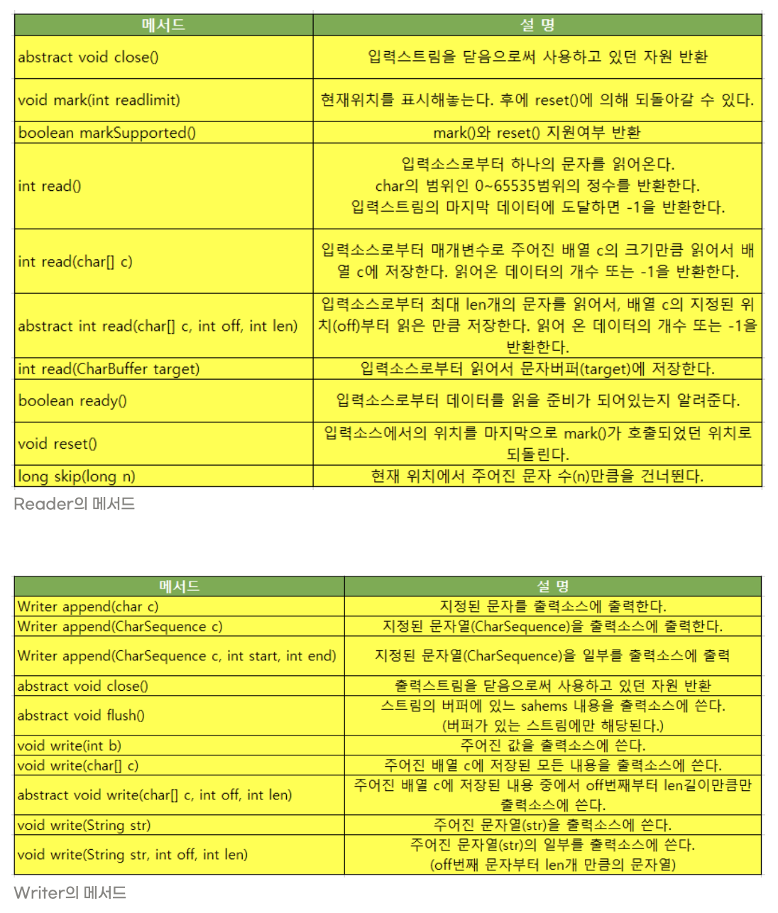
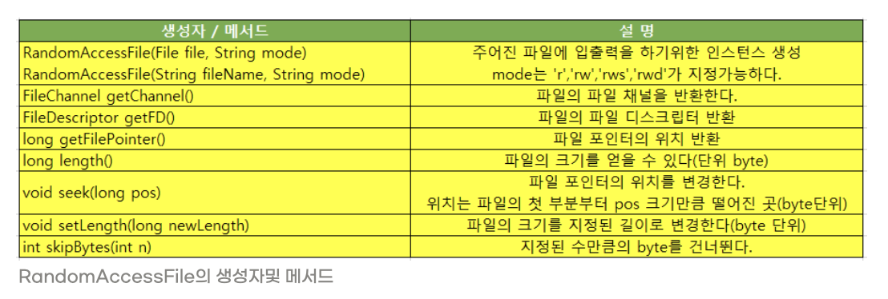
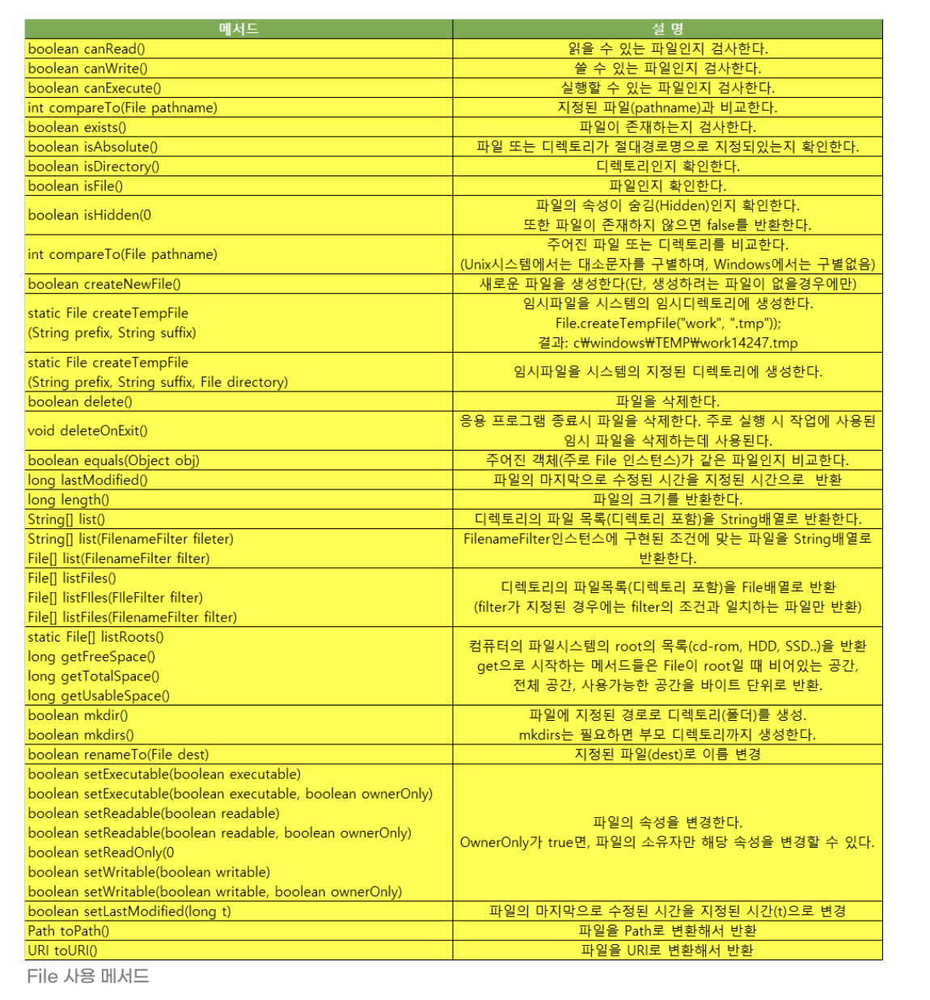
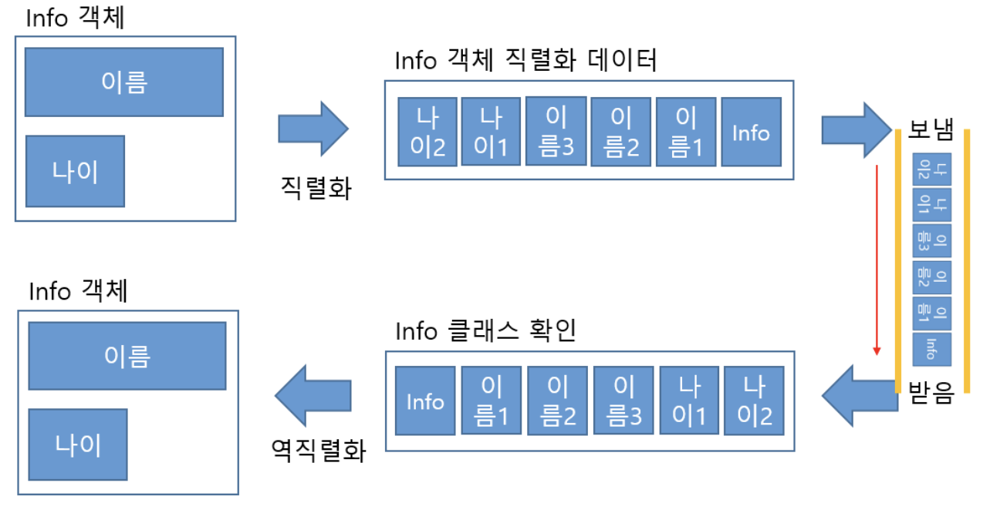
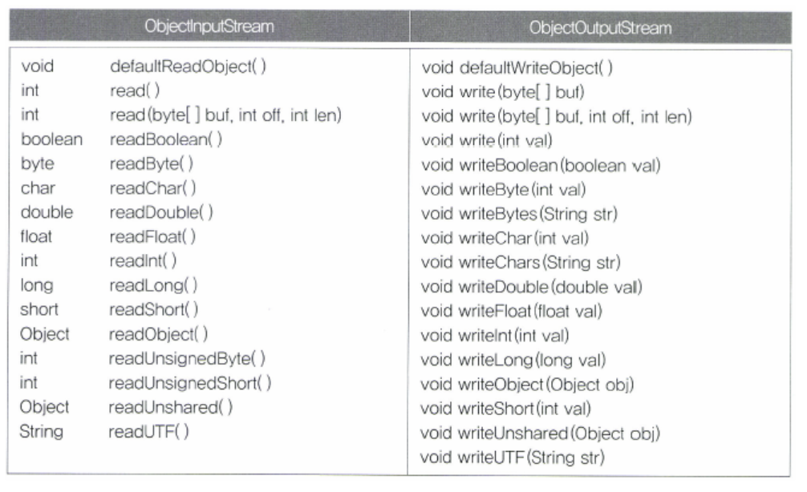

<!-- <p align="center"></p> -->

# 입출력이란?

I/O란 Input과 Output의 약자로 입력과 출력, 단단히 줄여서 입출력이라고 한다. 입출력은 컴퓨터 내부 또는 외부의 장치와 프로그램간의 데이터를 주고받는 것을 말한다.

- 이번 포스팅에서는 이러한 것들이 있다고 간단하게 익히고 필요할 때마다 찾아가는 식으로 하면 좋을 것 같다.

# 스트림(stream)

자바에서 입출력을 수행하려면, 두 대상을 연결하고 데이터를 전송할 수 있는 무언가가 필요한데 이것을 스트림(stream)이라고 한다.

- 이전 장(14장)의 스트림과 같은 용어를 쓰지만 다른 개념이다.
- 단방향 통신만 가능하다.
  - 입출력을 동시에 수행하려면 입력을 위한 입력스트림(input stream)과 출력을 위한 출력스트림(output stream) 모두 2개의 스트림이 필요하다.
  - 스트림은 먼저 보낸 데이터를 먼저 받게 되어있으며 중간에 건너뜀 없이 연속적으로 데이터를 주고받는다. (FIFO)

> 스트림이란 데이터를 운반하는데 사용되는 연결 통로이다.

## 바이트 기반 스트림

스트림은 바이트 단위로 데이터를 전송하며 입출력 대상에 따라 다음과 같은 입출력 스트림이 있다.

<p align="center"></p>
- InputStream 또는 OutputStream의 자손들이기 때문에 필요한 추상메서드를 자신에 맞게 구현해 놓았다.

<p align="center"></p>

- InputStream, OutputSteram을 구현할 때 read(), write()를 구현해야지만 다른 함수들도 다 사용 가능하다.
  - 다른 함수들은 read(), write()를 기반으로 만들어진 함수들이기 때문
- 위의 사진에 나온 함수들만 잘 쓸줄알면 데이터를 읽고 쓰는 것은 입출력 대상의 종류에 관계없이 잘 할 수 있다.

```java
    public abstreact class InputStream{
        ...
        // 입력스트림으로부터 1byte를 읽어서 반환한다. 읽을 수 없으면 -1을 반환한다.
        abstract int read();

        // 입력스트림으로부터 len개의 byte를 읽어서 byte배열 b의 off위치부터 저장한다.
        int read(byte[] b, int off, int len){
            ...
            for(int i=off; i<off+len; i++){
                // read()를 호출해서 데이터를 읽어서 배열을 채운다.
                b[i] = (byte) read();
            }
        }
        //  입력스트림으로부터 byte배열 b의 크기만큼 데이터를 읽어서 배열 b에 저장한다.
        int read(byte[] b){
            return read(b, 0, b.length);
        }
    }

```

## 보조스트림

볻조스트림은 스트림의 기능을 보완하기 위한 것으로, 실제 데이터를 주고받는 스트림이 아니기 때문에 데이터를 입출력할 수 있는 기능은 없지만, 스트림의 기능을 향상시키거나 새로운 기능을 추가할 수 있다.

```java
//기반 스트림 생성
FileInputStream fis = new FileInputStream("test.txt");
// 기반스트림을 이용해서 보조스트림을 생성한다
BufferedInputStream bis = new BufferedInputStream(fis);

bis.read(); // 보조스트림인 BufferedInputStream으로부터 데이터를 읽는다.
```

- 코드상으로는 보조스트림인 BufferedInputStream이 입력기능을 하는것으로 보이지만 실제 기능은 BufferedInputStream와 연결된 FileInputStream이 수행한다.
  - 보조스트림인 BufferedInputStream은 버퍼만 제공한다.
  - 버퍼를 사용한 입출력은 성능 향상이 상당하기에 대부분 버퍼를 이용한 보조스트림을 사용한다.

<p align="center"></p>

- 모든 보조스트림 역시 InputStream과 OutputSTream의 자손들이므로 사용법은 같다.

# 바이트 기반 스트림 상세

InputSTream과 OutputStream은 모든 바이트 기반 스트림의 조상이며 다음과 같은 메서드를 가지고있다.

<p align="center"></p>

```java
import java.io.*;
import java.util.Arrays;
public class IOEx3 {
    public static void main(String[] args){
        byte[] inSrc = {0, 1, 2, 3, 4, 5, 6, 7, 8, 9};
        byte[] outSrc = null;
        byte[] temp = new byte[4];
        ByteArrayInputStream input = null;
        ByteArrayOutputStream output = null;

        input = new ByteArrayInputStream(inSrc);
        output = new ByteArrayOutputStream();

        System.out.println("Input Source : "+ Arrays.toString(inSrc));

        try{
            while(input.available() > 0){
                input.read(temp);
                output.write(temp);

                outSrc = output.toByteArray();
                printArrays(temp, outSrc);
            }
        }catch(IOException e){}
    }
    static void printArrays(byte[] temp, byte[] outSrc){
        System.out.println("temp         : " + Arrays.toString(temp));
        System.out.println("output Source: " + Arrays.toString(outSrc));
    }
}
```

위의 예시를 실행하면 결과는 다음과 같다

<p align="center"></p>

마지막에 출력하는 배열의 9번째와 10번째 값이 이전 출력값인 6,7 이 출력된다.

- 보다 나은 성능을 위해서 temp에담긴 내용을 지우고 쓰는 것이 아니라 기존 내용위에 덮어 쓰는 것이기 때문이다.

따라서 코드를 다음과 같이 변경해주어야 한다.

```java
while(input.availabe() > 0){
    int len = input.read(temp);
    output.write(temp, 0, len);
}
```

즉 읽어온 만큼만 출력하도록, 읽어온 만큼만 write하는 것이다.

## FileInputSTream 과 FileOutputStream

FileInputSTream 과 FileOutputStream은 이름처럼 파일에 입출력을 하기 위한 스트림이다. 실제 프로그래밍에서 많이 사용되는 스트림중 하나이므로 잘 익혀두자.

<p align="center"></p>

# 바이트 기반의 보조 스트림

## FilterInputStream, FilterOutputStream

FilterInputStream과 FilterOutputStream은 InputStream, OutputStream의 자손이면서 모든 보조스트림의 조상이다.

```java
protected FilterInputStream(InputStream in);
public FliterOutputStream(OutputStream out);
```

하지만 FilterInputStream의 생성자는 protected이므로 FilterInputStream자체를 바로 쓸 수는 없고 반드시 오버라이딩 해서 사용해야한다.

따라서 FilterInputStream/FilterOutputStream을 상속받아서 구현한 보조스트림 클래스는 다음과 같다

FilterInputStream의 자손

- BufferedInputStream
- DataInputStream
- PushbackInputStream

FilterOutputStream의 자손

- BufferedOutputStream
- DataOutputStream
- PrintSTream

## BufferedInputStream과 BufferedOutputStream

- 바이트 단위가 아닌 버퍼 크기만큼 데이터를 읽어서 자신의 내부 버퍼의 저장하기 때문에 작업효율이 좋으므로 많이 사용한다.
- 버퍼가 가득 찼을 때만 출력소스에 출력을 하기 때문에, 모든 출력작업을 마친 후에는 colse()나 flush()를 호출해서 버퍼에 있는 모든 내용이 출력 내용이 출력되도록 해야한다.
  <p align="center"></p>

## DataInputSTream과 DataOutputStream

데이터를 읽고 쓰는데 있어서 byte단위가 아닌 8가지 기본 자료형의 단위로 읽고 쓸 수 있다는 장점이 있다.

- 여러가지 종류의 자료형을 출력한 경우, 읽을 때는 반드시 쓰인 순서대로 읽어야 한다.
  <p align="center"></p>

## SequenceInputStream

여러개의 입력스트림을 연속적으로 연결해서 하나의 스트림으로부터 데이터를 읽는 것 같이 처리할 수 있도록 도와준다

- 큰 파일을 여러개의 작은 파일로 나누었다가 하나의 파일로 합치는 것과 같은 작업을 수행할 때 사용하면 좋다.
  <p align="center"></p>

사용 예는 다음과 같다

```java
// ex1)
Vector files = new Vector();
files.add(new FileInputStream("file.001"));
files.add(new FileInputStream("file.002"));
SequenceInputStream in = new SequenceInputStream(files.elements());

// ex2)
FileInputStream file1 = new FileInputStream("file.001");
FileInputStream file2 = new FileInputStream("file.002");
SequenceInputStream in = new SequenceInputStream(file1, file2);
```

## PrintStream

- 데이터를 다양한 양식으로 출력할 수 있도록 기능을 제공하는 보조스트림이다.
- System.out 이 printStream이다.
- JDK1.1에서부터 printStream보다 향상된 PrintWriter가 추가되었으나 System.out이 PrintStream이라 이를 사용하게 되지만 다양한 언어의 문자를 처리하는데는 PrintWriter가 적합하기 때문에 가능하면 PrintWriter를 사용하자.

문자열 형식화 양식

<p align="center"></p>

# 문자기반 스트림

문자데이터를 다루는데도 스트림이 똑같이 사용된다. 단 앞에서 사용하는 바이트 기반 스트림과의 사용법이 거의 같기 때문에 가볍게 보고 넘어가면 좋을 것 같다.

## Reader와 Writer

- Reader와 Writer를 사용하고, byte배열 대신 char배열을 사용한다.
  <p align="center"></p>

## FileReader와 FileWriter

- 파일로부터 텍스트데이터를 읽고 쓰는데 사용한다.
- 사용법은 FileInputStream, FileOutputStream과 거의 같다.

## PipedReader와 PipedWriter

- 쓰레드간의 데이터를 주고 받을 때 사용한다.
- 입력과 출력스트림을 하나의 스트림으로 연결(connect)해서 데이터를 주고받는다는 특징이 있다.
- 한쪽 스트림만 닫아도 나머지 스트림은 자동으로 닫힌다.

```java
import java.io.*;
public class PipedReaderWriter {
    public static void main(String[] args){
        InputThread inThread = new InputThread("InputThread");
        OutputThread outThread = new OutputThread("OutputThread");

        inThread.connect(outThread.getOutput());

        inThread.start();
        outThread.start();
    }
}

class InputThread extends Thread{
    PipedReader input = new PipedReader();
    StringWriter sw = new StringWriter();

    InputThread(String name){
        super(name);
    }

    public void run(){
        try{
            int data = 0;
            while((data=input.read()) != -1){
                sw.write(data);
            }
            System.out.println(getName() + " received" + sw.toString());
        } catch(IOException e) {}
    }
    public PipedReader getInput(){
        return input;
    }
    public void connect(PipedWriter output){
        try{
            input.connect(output);
        } catch (IOException e){}
    }
}

class OutputThread extends Thread{
    PipedWriter output = new PipedWriter();

    OutputThread(String name){
        super(name);
    }

    public void run(){
        try{
            String msg = "Hello";
            System.out.println(getName() + " sent : " + msg);
            output.write(msg);
            output.close();
        } catch (IOException e){}
    }
    public PipedWriter getOutput(){
        return output;
    }

    public void connect(PipedReader input){
        try{
            output.connect(input);
        } catch(IOException e){}
    }
}
```

## StringReader 와 StringWriter

- CharArrayReader/CharArrayWriter 와 같이 입출력 대상이 메모리인 스트림이다.
- StringWriter에 출력되는 데이터는 내부의 StringBuffer에 저장된다.

```java
StringBuffer getBuffer() : StringWriter에 출력된 데이터가 저장된 StringBuffer를 반환한다.
String toSTring() : StringWriter에 출력된 (StringBuffer에 저장된) 문자열을 반환한다.
```

```java
import java.io.*;

class StringReaderWriterEx{
  public static void main(String[] args){
    String inputData = "ABCD";
    StringReader input = new StringReader(inputData);
    StringWriter output = new StringWriter();

    int data = 0;
    try{
      while((data = input.read()) != -1) {
        output.write(data);
      }
    } catch(IOException e) {};

    System.out.println("Input Data   :" + inputData);
    System.out.println("Output Data  :" + output.toString());
    System.out.println("Output Data  :" + output.getBuffer().toString());

  }
}
```

# 문자기반의 보조 스트림

## BufferedReader 와 BufferedWriter

BufferedReader와 BufferedWriter는 버퍼를 이용해서 입출력의 효율을 높여주기 때문에 알고리즘 문제를 풀때 정말 무조건 사용하게 된다. 아래 예제만 잘 알고있어도 충분히 이해할 것이다.

```java
import java.io.*;
public class BufferedReaderEx1 {
    public static void main(String[] args){
        try{
            FileReader fr = new FileReader("BufferedReaderEx1.java");
            BufferedReader br = new BufferedReader(fr);

            String line = "";

            for(int i=1; (line = br.readLine()) != null; i++){
                // ";"를 포함한 라인을 출력한다.
                if(line.indexOf(";") != -1) System.out.println(i+":"+line);;
            }
            br.close();
        } catch (IOException e){
            System.out.println(e.getMessage());
        }
    }
}

```

## InputStreamReader와 OutputStreamWriter

- 바이트 기반 스트림을 문자 기반 스트림으로 연결시켜주는 역할을 하는 보조스트림
- 바이트 기반 스트림 데이터를 지정된 인코딩 문자데이터 변환작업을 수행한다.
- OS에서 사용하는 인코딩 데이터 종류확인법
  - `System.out.println(System.getProperties().get("sun.jnu.encoding"));`

# 표준 입출력과 File

표준 입출력은 콘솔(console, 도스창)을 통한 데이터 입력과 콘솔로의 데이터 출력을 의미한다.

자바에서는 표준 입출력(standard I/O)을 위해 3가지 입출력 스트림인 System.in, System.out, System.err 를 제공하는데, 이는 자바 어플리케이션 실행과 동시에 사용할수 있게 자동 생성되기 때문에 별도로 스트림을 생성하는 코드를 작성하지 않아도 사용이 가능하다.

```java
System.in : 콘솔로부터 데이터를 입력 받는 데 사용
System.out : 콘솔로 데이터를 출력하는데 사용
System.err : 콘솔로 데이터를 출력하는데 사용
```

## RandomAccessFile

- 하나의 스트림으로 파일의 입력과 출력을 모두 수행할 수 있는 스트림
- 파일의 어느 위치에나 읽기, 쓰기가 가능하다.
  - 내부적으로 파일 포인터 사용
  - 다른 모든 입출력들도 이를 가지고 있지만, 내부적으로만 사용되기에 작업자가 자유롭게 이를 바꿀 수 없다.
- DataInputStream, DataOutputStream 처럼 기본 자료형 단위로 데이터를 읽고 쓸 수 있다.
  <p align="center"></p>

## File

파일은 기본적이면서도 가장 많이 사용되는 입출력 대상이다. 자바에서는 File클래스를 통해서 파일과 디렉토리를 다룰 수 있도록 하고 있다.

  <p align="center"></p>

- File인스턴스를 생성했다고 해서 파일이나 디렉토리가 생기는 것이 아니다.
- 새로운 파일을 생성하기 위해서 File인스턴스를 생성한 다음, 출력스트림을 생성하거나 createNewFile()을 호출해야한다.

1. 이미 존재하는 파일을 참조할 때 :

   ```java
   File f = new File("파일경로", "파일이름);
   ```

2) 기존에 없는 파일을 새로 생성할때 :
   ```java
   File f = new File("파일경로", "파일이름");
   f.createNewFile(); // 이때 새로운 파일이 생성된다.
   ```

### 파일 관련 메소드

  <p align="center"></p>

# 직렬화(Serialization)

직렬화(serialization)란 객체를 데이터 스트림으로 만드는 것을 뜻한다. 객체에 저장된 데이터를 스트림에 쓰기(write)위해 연속적인(serial) 데이터로 변환하는 것을 말한다.

- 객체를 저장한다는 것은 객체의 모든 인스턴스 변수의 값을 저장하는 것과 같은 의미이다.
- 객체의 직렬화, 역직렬화에는 ObjectInputStream, ObjectOutputStream을 사용한다.
  <p align="center"></p>

위의 사진처럼 객체를 직렬화하여 스트림으로 보내고, 다시 받을 때는 역직렬화 과정을 통해 다시 객체를 만들어 준다.

## ObjectInputStream, ObjectOutputStream

ObjectInputStream오ㅓㅏ ObjectOutputStream은 결국 보조스트림이기 때문에 사용하기전에 입출력할 스트림을 지정해 주어야한다.

```java
ObjectInputStream(InputStream in)
ObjectOutputStream(OutputSTream out)
```

직렬화 예시

```java
FileOutputStream fos = new FileOutputStream("objectfile.ser");
ObjectOutputStream out = new ObjectOutputSTream(fos);

out.writeObject(new UswerInfo());
```

역직렬화 예시

```java
FileInputStream fis = new FileInputStream("objectfile.ser");
ObjectInputStream in = new ObjectInputStream(fis);

UserInfo info = (UserInfo)in.readObject();
```

<p align="center"></p>

## 직렬화가 가능한 클래스 만들기 - Serializable 그리고 transient

직렬화가 가능한 클래스를 만드는 방법은 직렬화 하고자 하는 클래스가 java.io.Srializable 인터페이스를 구현하면 된다.

```java
public class MyClass implements Serializable{
  String name;
  String password;
  int age;
}
```

클래스에 직렬화가 안되거나 하면 안되는 객체에 대한 참조를 포함하고 있다면 제어자 transient를 붙여서 직렬화 대상에서 제회되도록 할 수 있다.

```java
public class UserInfo implements Serializable{
  String name;
  transient String password; // 직렬화 대상에서 제외된다.
  int age;
}
```

# Reference

- 남궁성, Java의 정석 (3rd Edition), 도우출판
- 사진 및 내용일부
  - https://blog.daum.net/gunsu0j/111
  - https://catsbi.oopy.io/20112bd1-0d38-48ab-b8bc-c01fded65fab
