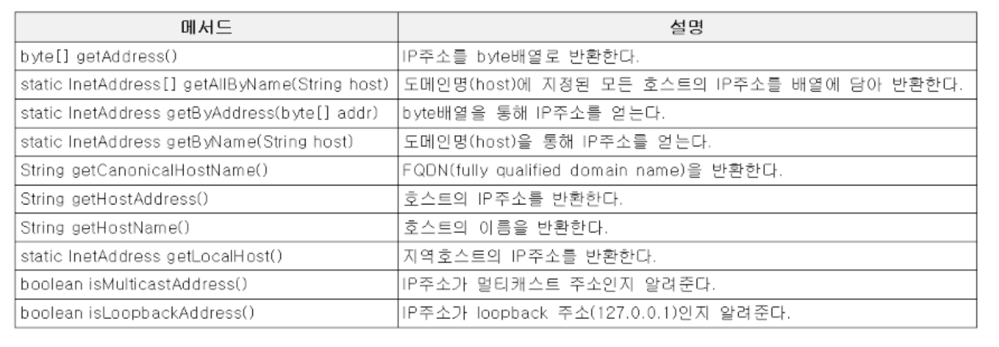
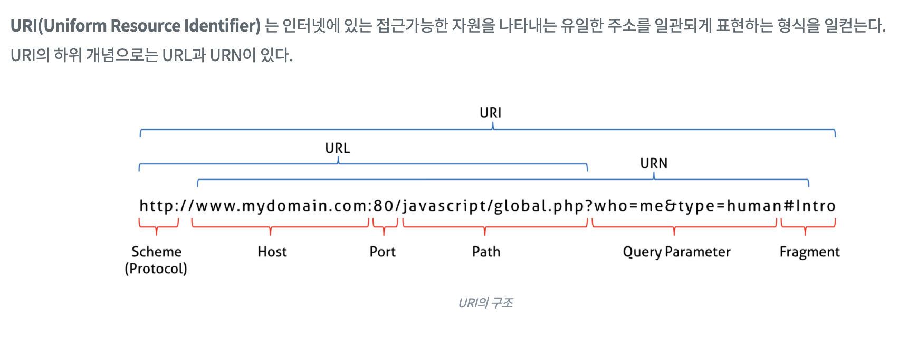
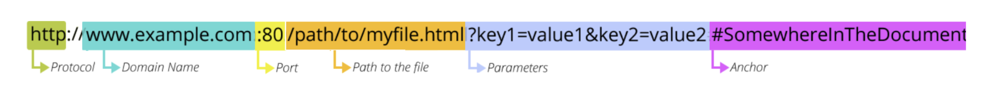

<!-- <p align="center"></p> -->

# 네트워킹 (Networking)

네트워킹이란 두 대 이상의 컴퓨터를 케이블로 연결하여 네트워크(network)를 구성하는 것을 말한다.

자바에서 제공하는 java.net패키지를 사용하면 네트워크 어플리케이션의 데이터 통신 부분을 쉽게 작성할 수 있다.

## 클라이언트(client)와 서버(server)

클라이언트와 서버는 컴퓨터간의 관계를 역할로 구분하는 개념이다.

- 서버 (server) : 서비스를 제공하는 컴퓨터(service provider)
- 클라이언트 (client) : 서비스를 사용하는 컴퓨터 (service user)

## 네트워크 구성 모델

서버 기반 모델(server-based model)

- 안정적인 서비스의 제공이 가능하다.
- 공유데이터의 관리와 보안이 용이하다.
- 서버구축비용과 관리비용이 든다.

P2P 모델(peer-to-peer model)

- 서버 구축 및 운용 비용을 절감할 수 있다.
- 자원의 활용을 극대화 할 수 있다.
- 자원의 관리가 어렵다.
- 보안이 취약하다.

# IP 주소 (IP address)와 InetAddress

- IP주소는 컴퓨터(호스트, host)를 구별하는데 사용되는 고유한 값이다.
- 인터넷에 연결된 모든 컴퓨터는 IP주소를 갖는다
- IP주소는 4byte(32bit)의 정수가 마침표를 구분자로 'a.b.c.d' 와 같은 형식으로 표현된다.

InetAddress는 자바에서 IP주소를 다루기 위한 클래스로 만들어졌다.

<p align="center"></p>

# URL(Uniform Resource Locator)

<p align="center"></p>
URI(Uniform Resource Identifier)는 인터넷에 있는 접근가능한 자원을 나타내는 유일한 주소를 일관되게 표현하는 양식을 일컫는다. URI의 하위 개념으로는 URL과 URN이 있다.

URL은 인터넷에 존재하는 여러 서버들이 제공하는 자원에 접근할 수 있는 주소를 표현하기 위한 것으로 '프로토콜://호스트명: 포트번호/경로명/파일명?쿼리스트링#참조'의 형태로 이루어져 있다.

<p align="center"></p>

```java
프로토콜 : 자원에 접근하기 위해 서버와 통신하는데 사용되는 규약(http)
호스트명(DomainName) : 자원을 제공하는 서버의 이름
포트번호 : 통신에 사용되는 서버의 포트번호
경로명(path) : 접근하려는 자원이 저장된 서버의 위치
쿼리 : URL에서 ? 이후의 부분
참조 : URL에서 #이후의 부분
```

URL 같은 경우 자주 사용될 수 있으므로 필요할 때마다 [공식문서](https://docs.oracle.com/javase/7/docs/api/java/net/URL.html)에서 찾아 쓰도록 하자.

## URL Connection

URLConnection은 어플리케이션과 URL간의 통신 연결을 나타내는 클래스의 최상위 클래스로 추상클래스이다.

- 상속 받아 구현한 클래스로 HttpURLConnection과 JarURLConnection이 있다.

URL Connection을 사용하여 해당 URL의 HeaderField, URL, ContentLength등 다양한 정보를 얻을 수 있다. 또한 URL의 연결하여 해당 정보를 얻을 수 있다.

한번에 openStream을 호출한 것은 URLConnection을 얻은뒤 getInputStream을 한것 과 같다.

```java
URL url = "https://www.naver.com";
InputStream in = url.openStream();
/// 위는 아래와 같다.
URLConnection conn = url.openConnection();
InputStream in = conn.getInputStream();
```

# 소켓프로그래밍

소켓(socket)이란 프로세스 간의 통신에 사용되는 양쪽 끝단(endpoint)을 의미한다. 프로세스간의 통신을 위해서는 소켓이 필요하다.

## TCP 소켓 프로그래밍

TCP소켓 프로그래밍의 서버와 클라이언트의 통신과정은 다음과 같다.

1. 서버 프로그램에서는 서버소켓을 사용해서 서버 컴퓨터의 특정 포트에서 클라이언트의 연결요청을 처리할 준비를 한다.
2. 클라이언트 프로그램은 접속할 서버의 IP주소와 포트 정보를 가지고 소켓을 생성해서 서버에 연결을 요청한다.
3. 서버 소켓은 클라이언트의 연결요청을 받으면 서버에 새로운 소켓을 생성해서 클라이언트의 소켓과 연결되도록 한다.
4. 이후 클라이언트의 소켓과 새로 생성된 서버의 소켓은 서버 소켓과 관계없이 일대일 통신을 한다.

다시한번 말하면

- 서버소켓(ServerSocket)은 포트와 결합(bind)되어 포트를 통해 원격 사용자의 연결요청을 기다린다.
- 연결요청이 오면 새로운 소켓을 생성하여 상대편 소켓과 통신할 수 있도록 연결한다.

각 소켓은 두 개의 스트림 즉 입력스트림과 출력스트림을 가지고 있으며, 이 스트림들은 연결된 상대편 소켓의 스트림과 교차연결된다.

- (서버소켓의 입력스트림 <-> 클라이언트 소켓의 출력스트림)
- (서버소켓의 출력스트림 <-> 클라이언트 소켓의 입력스트림)

## TCP소켓 채팅방 예제

채팅방 예제 같은 경우 서버의 접속하는 클라이언트의 수가 많기 때문에 쓰레드를 이용해서 클라이언트의 요청을 병렬적으로 처리하는 것이 좋다. 서버가 접속을 요청한 순서대로 처리하기 때문에 늦게 접속을 요청한 클라이언트는 오랜 시간을 기다릴 수 있다.

서버

```java
package Network;

import java.net.*;
import java.io.*;
import java.util.*;

public class TcpIpMultichatServer {
    // 서버에서 들어오는 client들을 Thread를 생성하여 해당 정보를 넣어 보관할 맵
    HashMap clients;


    TcpIpMultichatServer(){
        clients = new HashMap();
        Collections.synchronizedMap(clients);
    }

    public void start(){
        ServerSocket serverSocket = null;
        Socket socket = null;

        try{
            //7777번 포트에 서버 소켓을 연다.
            serverSocket = new ServerSocket(7777);
            System.out.println("서버가 시작되었습니다.");

            while(true){
                // serverSocket에 연결을 시도하면 해당 소켓의 연결을 허용해준다.
                socket = serverSocket.accept();
                System.out.println("["+socket.getInetAddress()+":"+socket.getPort()+"]에서접속하였습니다.");
                // Thread를 생성하여 들어온 소켓과 1:1 연결을 하는 소켓을 만들어줄 예정이다.
                ServerReceiver thread = new ServerReceiver(socket);
                thread.start();

            }
        } catch (IOException e) {
            e.printStackTrace();
        }
    }
    // HashMap에 저장한 모든 clients들에게 일괄적으로 message를 보내주는 함수
    void sendToAll(String msg){
        Iterator it = clients.keySet().iterator();

        while(it.hasNext()){
            try{
                DataOutputStream out = (DataOutputStream)clients.get(it.next());
                out.writeUTF(msg);
            } catch (IOException e){}
        }
    }
    // 채팅 서버를 실행하는 main함수
    public static void main(String[] args){
        new TcpIpMultichatServer();
    }

    // Client의 socket과 연결하는 Thread
    class ServerReceiver extends Thread{
        Socket socket; // 클라이언트와 연결할 소켓
        DataInputStream in;
        DataOutputStream out;

        // 서버 소켓이 생성한 쓰레드의 input, outputStream 을 생성해주는 생성자
        ServerReceiver(Socket socket){
            this.socket = socket;
            try{
                in = new DataInputStream(socket.getInputStream());
                out = new DataOutputStream(socket.getOutputStream());
            } catch (IOException e){}
        }
        // 쓰레드의 동작
        public void run(){
            String name= "";

            try{
                // readUTF함수는 스케너처럼 상대가 입력하지 않으면 계속 기다린다.
                // 우리 채팅서버에서 클라이언트는 연결 시 먼저 자기 이름을 보내므로, 받은 이름을 저장
                name = in.readUTF();
                // 새로운 클라이언트가 접속했음을 알린다.
                sendToAll("#"+name+"님이들어오셨습니다.");

                // clients Map에 새로온 클라이언트의 정보를 저장하며, outputStream도 같이 저장한다.
                clients.put(name, out);
                System.out.println("현재 서버접속자 수는 " + clients.size() + "입니다.");
                while(in != null){
                    // 이후 client의 정보가 들어올 때마다 계속 해당 데이터를 채팅방에 뿌려준다.
                    // 스트림이 닫히면 in==null이 된다.
                    sendToAll(in.readUTF());
                }
            } catch (IOException e) {
                e.printStackTrace();
            } finally {
                // 연결이 끊기면 해당 클라이언트가 나간것을 알려준다.
                sendToAll("#"+ name + "님이 나가셨습니다.");
                clients.remove(name);
                System.out.println(" 해당 유저는 접속을 종료하였습니다.");
            }
        }

    }
}


```

클라이언트

```java
package Network;

import java.net.*;
import java.io.*;
import java.util.Scanner;

public class TcpIpMultichatClient {

    public static void main(String[] args){
        if(args.length != 1){
            System.out.println("USAGE: java TcpIpMultichatClient 대화명");
        }
        try{
            String serverIp = "127.0.0.1";
            // serverIp의 7777번 포트로 ㅇ녀결한다.
            Socket socket = new Socket(serverIp, 7777);
            System.out.println("서버에 연결 되었습니다.");

            // sender와 receiver 쓰레드를 각각 생성하며, 연결된 소켓으로 스트림을 연결한다.
            Thread sender = new Thread(new ClientSender(socket, args[0]));
            Thread receiver = new Thread(new ClientReceiver(socket));

            sender.start();
            receiver.start();
        } catch (UnknownHostException e) {
            e.printStackTrace();
        } catch (IOException e) {
            e.printStackTrace();
        }
    }
    // Sender, outputStream
    static class ClientSender extends Thread{
        Socket socket;
        DataOutputStream out;
        String name;

        ClientSender(Socket socket, String name){
            this.socket = socket;
            try{
                out = new DataOutputStream(socket.getOutputStream());
                this.name = name;
            } catch (IOException e) {
                e.printStackTrace();
            }
        }
        public void run(){
            Scanner scanner = new Scanner(System.in);
            try{
                // 연결이 되면 먼저 이름부터 보내준다.
                if(out!=null){
                    out.writeUTF(name);
                }
                // 연결이 끊기기 전까지 Scanner에서 입력된 모든 데이터들을 다시 보내준다.
                while(out!=null) out.writeUTF("[" + name + "]" + scanner.nextLine());
            } catch (IOException e) {
                e.printStackTrace();
            }
        }
    }
    // Reciever, inputStream
    static class ClientReceiver extends Thread{
        Socket socket;
        DataInputStream in;

        ClientReceiver(Socket socket){
            this.socket = socket;
            try{
                in = new DataInputStream(socket.getInputStream());
            } catch (IOException e) {
                e.printStackTrace();
            }
        }
        public void run(){
            // 들어오는 모든 데이터들을 바로 출력해준다.
            while(in != null){
                try{
                    System.out.println(in.readUTF());
                } catch (IOException e) {
                    e.printStackTrace();
                }
            }
        }
    }
}

```

# UDP 소켓 프로그래밍

- UDP에서 사용하는 소켓은 DatagramSocket이고, 데이터를 DatagramPacket에 담아서 전송한다.
- UDP는 연결지향적인 프로토콜이 아니기 때문에 ServerSocket이 필요하지 않다.
- DatagramPacket은 헤더와 데이터로 구성되어있다.
  - 헤더에는 DatagramPacket을 수신할 호스트의 정보(주소와 포트)가 저장되어있다.

## UDP 소켓 프로그래밍 예제

서버로부터 서버시간을 전송받아 출력하는 UDP 소켓 클라이언트, 서버 프로그램 예제이다.

- 클라이언트가 DatagramPacket을 통해 DatagramSocket으로 서버에 전송하면, 서버는 전송받은 DatagramPacket의 getAddress(), getPort()를 호출해서 클라이언트의 정보를 얻어서 서버 시간을 Datagrampacket에 담아서 전송한다.

Server

```java
package Network;

import java.net.*;
import java.io.*;
import java.nio.charset.StandardCharsets;
import java.util.Date;
import java.text.SimpleDateFormat;

public class UdpServer {
    public void start() throws IOException{
        // 포트 7777번을 사용하는 소켓을 생성한다
        DatagramSocket socket = new DatagramSocket(7777);
        DatagramPacket inPacket, outPacket;

        byte[] inMsg = new byte[100];
        byte[] outMsg;

        while(true){
            //데이터를 수신하기 위한 패킷을 생성한다.
            inPacket = new DatagramPacket(inMsg, inMsg.length);

            // 패킷을 통해 데이터를 수신(receive)한다.
            socket.receive(inPacket);

            //수신한 패킷으로부터 client의 IP주소와 Port를 얻는다.
            InetAddress address = inPacket.getAddress();
            int port = inPacket.getPort();

            // 서버의 현재 시간을 시분초 형태 [hh:mm:ss] 로 반환한다
            SimpleDateFormat sdf = new SimpleDateFormat("[hh:mm:ss]");
            String time = sdf.format(new Date());
            outMsg = time.getBytes(); //time을 byte배열로 변환

            // 패킷을 생성해서 Client에게 전송(send)한다.
            outPacket = new DatagramPacket(outMsg, outMsg.length, address, port);
            socket.send(outPacket);
        }
    }

    public static void main(String[] args){
        try{
            new UdpServer().start();
        } catch (IOException e) {
            e.printStackTrace();
        }
    }
}

```

Client

```java
package Network;

import java.net.*;
import java.io.*;
public class UdpClient {
    public void start() throws IOException, UnknownHostException{
        DatagramSocket datagramSocket = new DatagramSocket();
        InetAddress serverAddress = InetAddress.getByName("127.0.0.1");

        // 데이터가 저장될 공간으로 byte배열을 생성한다.
        byte[] msg = new byte[100];

        DatagramPacket outPacket = new DatagramPacket(msg, 1, serverAddress, 7777);
        DatagramPacket inPacket = new DatagramPacket(msg, msg.length);

        datagramSocket.send(outPacket);
        datagramSocket.receive(inPacket);

        System.out.println("current server time : " + new String(inPacket.getData()));

        datagramSocket.close();
    }
    public static void main(String[] args){
        try{
            new UdpClient().start();
        }  catch (Exception e) {
            e.printStackTrace();
        }
    }
}

```

# Reference

- 남궁성, Java의 정석 (3rd Edition), 도우출판
- 사진 : https://velog.io/@vgo_dongv/Java-InetAddress
