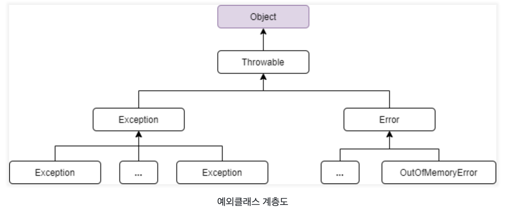
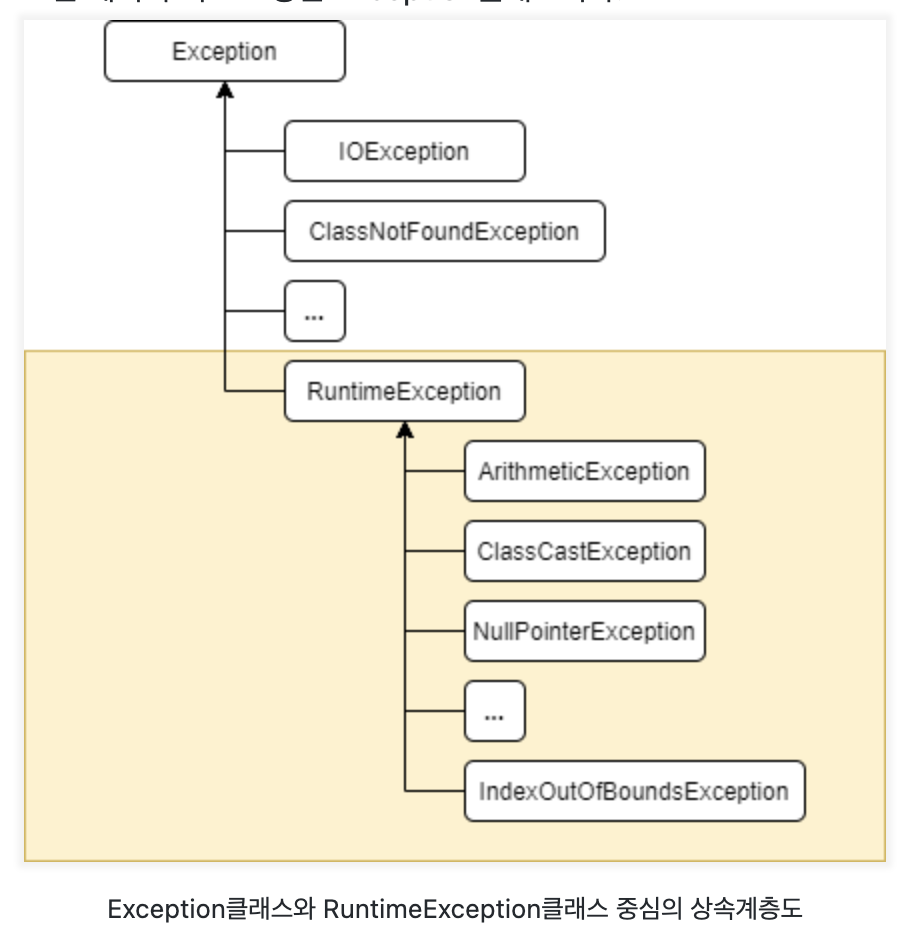

# 예외처리(exception handling)

- 컴파일 에러 : 컴파일 시에 발생하는 에러
- 런타임 에러 : 실행시에 발생하는 에러
- 논리적 에러 : 실행은 되지만, 의도와 다르게 동작하는 것

이중 런타임에러를 방지하기 위해 프로그램의 실행 중 발생할 수 있는 모든 경우의 수를 고려하여 이에 대한 대비가 필요하다 자바에서는 런타임에러에서 발생할 수 있는 프로그램 오류를 에러와 예외로 구분한다.

- 에러(error) : 프로그램 코드에 의해서 수습될 수 없는 심각한 오류
- 예외(exception) : 프로그램 코드에 의해서 수습될 수 있는 다소 미약한 오류

<p align="center"></p>

위의 사진처럼 모든 예외의 최고 조상 클래스는 Exception 클래스이다.

<p align="center"></p>

또한 Exception의 자손클래스들은 위에 사진처럼 2가지 그룹으로 나눌 수 있다.

1. Exception 클래스와 그 자손들
   - 외부의 영향으로 발생할 수 있는 것들이다.
   - 주로 프로그램의 사용자들의 동작에 의해서 발생하는 경우가 많다.
   - ex) 존재하지 않는 파일 입력(FileNotFoundException), 잘못된 데이터 형식 입력 (DataFormatException)
2. RuntimeException 클래스와 그 자손들
   - 프로그래머의 실수에 의해 발생할 수 있는 에러들
   - ex) 배열의 범위 벗어남(ArrayIndexOutOfBoundsException), 정수를0으로나눔(ArithmeticException)

## try-catch 문

예외처리(exception handling)란, 프로그램 실행 시 발생할 수 있는 예기치 못한 예외의 발생에 대비한 코드를 작성하는 것이다.

- 예외 발생으로 인한 프로그램의 갑작스런 비정상 종료를 막는다
- 정상적인 실행상태를 유지할 수 있도록 한다.

```java
try{
	// 예외가 발생할 가능성이 있는 문장들이 들어감
}catch(Exception1 e1){
	// Exception1 이 발생할 경우 이를 처리할 문장이 들어감
}catch(Exception2 e2){
	// Exception2 이 발생할 경우 이를 처리할 문장이 들어감
}catch(Exception3 e3){
	// Exception3 이 발생할 경우 이를 처리할 문장이 들어감
}
```

위의 예시처럼 하나의 try블럭에는 여러종류의 예외를 처리할 수 있도록 하나 이상의 catch 블럭이 올 수 있다.

발생한 예외의 종류와 일치하는 단 한개의 catch 블럭만 수행된다. 마치 else if 문과 비슷하다.

## try-catch 문의 흐름

- try 블럭 내에서 예외가 발생한 경우 1. 발생한 예외와 일치하는 catch 블럭을 확인한다. 2. 일치하는 catch 블럭을 찾게되면 해당 catch블럭내의 문장을 수행한 후 catch문을 빠져나가서 다음 문장을 계속 실행한다. 만약 일치하는 catch블럭이 없을 경우 예외는 처리되지 않는다.

- try 블럭 내에서 예외가 발생하지 않은 경우 1. catch블럭을 거치지 않고 전체 try-catch문을 빠져나가서 수행을 계속한다.

이때 발생한 예외와 일치하는 catch블럭을 찾을 때는 예외 클래스의 인스턴스에 instanceof 연산자를 사용하여 일치하는 예외클래스를 찾는다.

모든 예외 클래스는 Exception의 자손이므로, catch 블럭의 괄호()에 Exception 클래스 탑이의 참조 변수를 선언해 놓으면 어떤 종류의 예외가 발생하더라도 이 catch블럭에 의해서 처리된다.

### printStackTrace()

예외발생 당시의 호출스택(Call Stack)에 있었던 메서드의 정보와 예외 메세지를 화면에 출력한다.

### getMessage()

발생한 예외클래스의 인스턴스에 저장된 메시지를 얻을 수 있다.

## 예외 발생시키기 throw

throw 명령어를 통해 예외를 발생시킬 수 있으며, Exception 인스턴스를 생성할 때 생성자에 String을 넣어주면 Exception 인스턴스에 메시지로 저장되며 이를 getMessage()를 통해 얻을 수 있다.

1. 연산자 new를 이용하여 발생시키려는 예외 클래스의 객체를 만든다
   - ex) Exception e = new Exception("my Exception");
2. throw 키워드를 사용하여 예외를 발생시킨다.
   - ex) throw e
   - ex) throw new Exception("my Exception");

## 메서드에 예외 선언하기

메서드에 throws 키워드를 사용하여, 메서드 내에서 발생하는 예외에 대해 적어 줄 수 있다.

```java
void method() throws Exception1, Exception2, ... ExceptionN{
	/// 메서드 내용
}
```

- 이렇게 메서드를 작성할 때 메서드 내에서 발생할 가능성이 있는 예외를 메서드의 선언부에 명시하면 이 메서드를 사용하는 쪽에는 **이에 대한 처리를 하도록 강요** 할 수 있다.
- 보통 반드시 처리해주어야 하는 예외들만 선언한다.
- Java API 문서를 통해 사용하고자 하는 메서드의 선언부와 "Throws" 를 보고 해당 메서드에서는 어떤 예외가 발생할 수 있는지 확인하는 것이 좋다.

## finally 블럭

finally 블럭은 예외의 발생 여부에 상관없이 실행되어야 할 코드를 포함시킬 목적으로 사용된다. try - catch - finally

```java
try{
	// 예외가 발생할 가능성이 있는 문장들을 넣는다.
}catch(Exception1 e1){
	// 예외처리를 위한 문장을 적는다.
}finally{
	// 예외의 발생여부와 관계없이 항상 수행되어야 하는 문장들을 넣는다
	// finally블럭은 try-catch문의 맨 마지막에 위치해야한다.
}
```

- 메서드에서 try블럭이나 catch블럭에서 return 문이 실행되더라도 finally문장들이 먼저 실행 된 후에 현재 실행중인 메서드를 종료한다.

## 자동 자원 반환 try - with - resources

try에 사용한 후에 꼭 닫아줘야하는 자원 객체를 전달하면, try 코드 블럭이 끝나면 자동으로 자원을 종료해주는 기능이다.

- 따로 finally 블럭이나 모든 catch 블록에 종료 처리를 하지 않아도 된다.
- 자동으로 객체의 close()가 호출 될 수 있으려면 클래스가 AutoCloseable이라는 인터페이스를 구현한 것이어야만 한다.

```java
	try(SomeResource resource = getResource()){
		use(resource);
	} catch(...){
		...
	}
```

위와 같이 try문의 괄호()안에 객체를 생성하는 문장을 넣으면, 이 객체는 따로 close()를 호출하지 않아도 try블럭을 벗어나는 순간 자동적으로 close()가 호출된다.

이후 catch 블럭 또는 finally 블럭이 수행된다.

## 사용자 정의 예외(Exception) 만들기

기존의 정의된 예의 클래스 외에 필요에 따라 새로운 예외 클래스를 만들어야한다. 보통 Exception 클래스 또는 RuntimeException 클래스로부터 상속받아 클래스를 만든다.

- 가능하면 새로운 예외 클래스를 만들기 보단 기존의 예외 클래스를 활용하는 것이 좋다.

```java
class MyException extends Exception{
	MyException(String msg){ // 문자열을 매개변수로 받는 생성자
		super(msg); // 조상인 Exception 클래스의 생성자를 호출해야한다.
	}
}
```

따라서 다음과 같은 예제처럼 기존 Exception 클래스를 향상시킬 수 있다.

```java
class MyException extends Exception{
	//에러 코드 값을 저장하기 위한 필드를 추가
	private final int ERR_CODE; // 생성자를 통해 초기화 한다

	MyException(String msg, int errCode){ // 생성자
		super(msg);
		ERR_CODE = errCode;
	}

	MyException(String msg){
		this(msg, 100) // ERR_CODE를 100(defualt)로 초기화 한다
	}

	public int getErrCode(){
		return ERR_CODE; //get Message 처럼 사용될 예정.
	}
}
```

## 출처

- Exception 관련 사진 : https://staticclass.tistory.com/69
- try-with-resource : https://ryan-han.com/post/java/try_with_resources/
