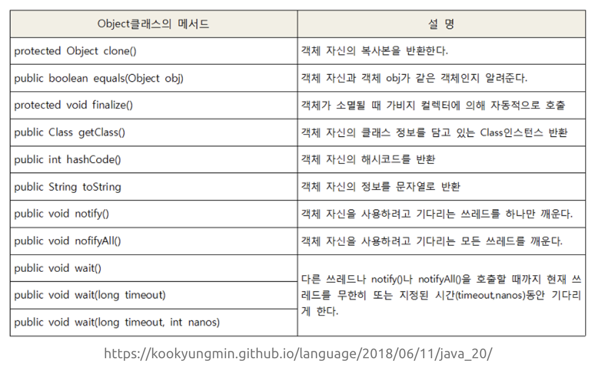
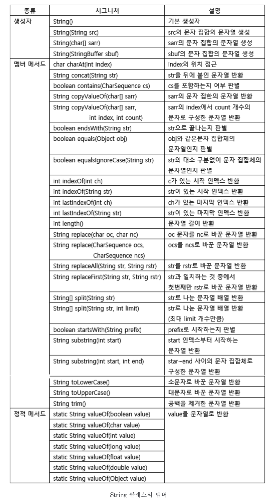
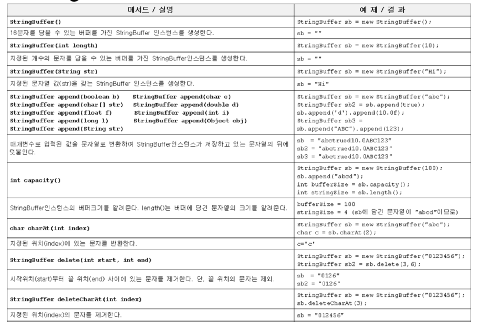
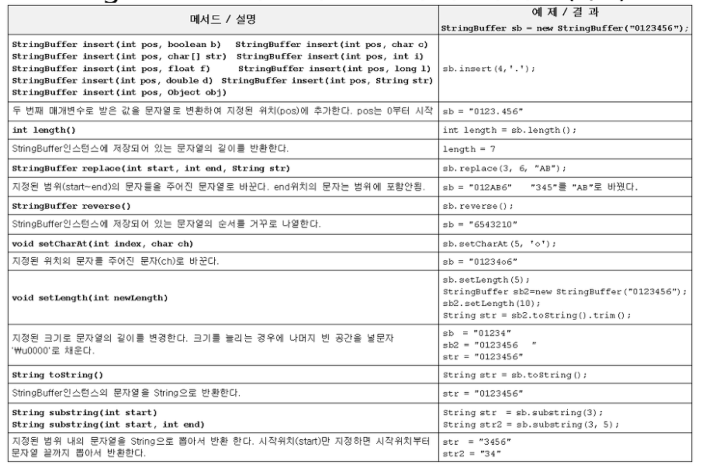
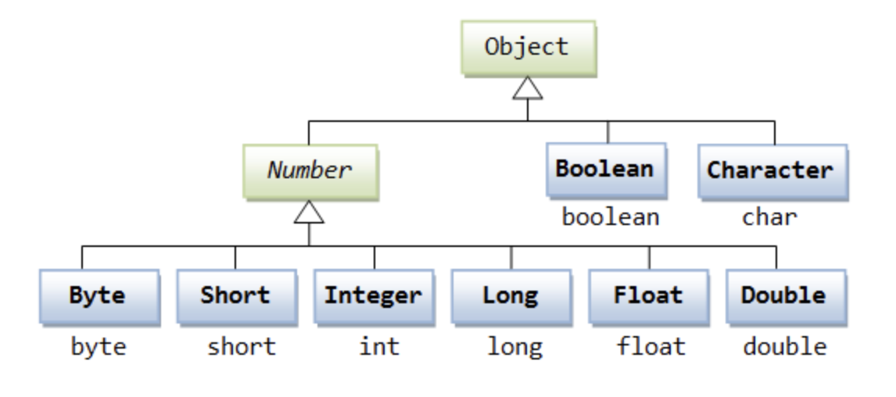
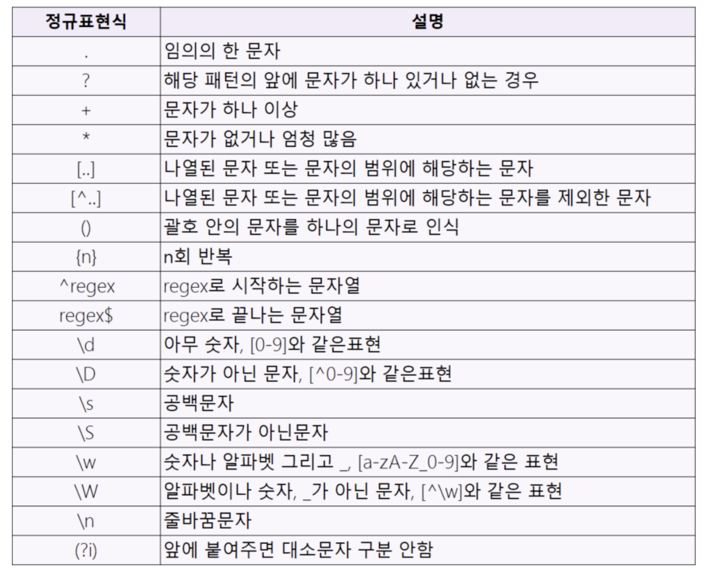

# java.lang 패키지

java.lang패키지에는 자바프로그래밍에서 가장 기본이 되는 클래스들을 포함하고 있다. 따라서 import문 없이도 java.lang패키지의 클래스들을 사용할 수 있다.

# Object클래스

Object클래스는 모든 클래스의 최고 조상이기 때문에 Object클래스의 멤버들은 모든 클래스에서 바로 사용가능하다.

<p align="center"></p>

## equals(Object obj)

매개변수로 객체의 참조변수를 받아서 비교하여 그 결과를 boolean 값으로 알려준다.

- 두 객체의 같고 다름을 참조변수로 판단한다.
- 주소값으로 비교하기 때문에 인스턴스의 value가 같을지라도 주소가 다르면 false를 리턴한다.
- 따라서 value를 비교하고 싶으면, equals 메서드를 오버라이딩하여 주소가 아닌 객체에 저장된 값으로 내용을 비교하도록 변경하면 된다.

## toString()

인스턴스에 대한 정보를 문자열(String)로 제공할 목적으로 정의한 것이다.

```java
public String toString(){
	return getClass().getName()+"@"+Integer.toHexString(hashcode());
}
```

클래스를 작성할 때 toString()을 오버라이딩 하지 않으면 위와같은 내용을 얻으므로, 대부분 toString함수를 오버라이딩하여 사용한다.

## clone()

- 자신을 복제하여 새로운 인스턴스를 생성하는 일을 한다.
- clone()은 단순히 인스턴스의 값만 복사하기 때문에 참조타입의 인스턴스 변수가 있는 클래스는 얕은 복사가 이루어진다.
- Cloneable인터페이스를 구현한 클래스에서만 clone()을 호출 할 수 있다. 그렇지 않으면 예외가 발생한다.
- Cloneable인터페이스가 구현되어있다는 것은 클래스 작성자가 복제를 허용한다는 의미이다.

```java
class Point implements Cloneable{
	int x, y;
	Point(int x, int y){
		this.x = x;
		this.y = y;
	}
	// toString도 대부분 오버라이딩하여 사용한다.
	public String toString(){
		return "x=" + x + ", y="+y;
	}
	public Object clone(){
		Object obj = null;
		try{
			obj = super.clone(); // clone()은 반드시 예외처리를 해주어야한다.
		}
	}catch(CloneNotSupportedException e){}
	return obj;
}

class CloneEx1{
	public static void main(String[] args){
		Point original = new Point(3,5);
		Point copy = (Point)original.clone();
	}
}
```

### 공변반환타입

JDK1.5부터 추가된 기능으로 오버라이딩할 때 조상 메서드의 반환타입을 자손 클래스의 타입으로 변경을 허용한다.

```java
public Object clone(){
		Object obj = null;
		try{
			obj = super.clone(); // clone()은 반드시 예외처리를 해주어야한다.
		}
	}catch(CloneNotSupportedException e){}
	return obj;
}
// 위에 예제에서 사용했던 이 함수를 아래와 같이 바꿔줄 수 있다.

public Point clone(){
		Object obj = null;
		try{
			obj = super.clone(); // clone()은 반드시 예외처리를 해주어야한다.
		}
	}catch(CloneNotSupportedException e){}
	return (Point)obj; //실제로 사용할 자손 객체로 반환
}
```

실제로 반환되는 자손 객체의 타입으로 봔환할할 수 있어서 번거로운 형 변환이 줄어든다는 장점이 있다.

## Shallow Copy vs Deep Copy

Shallow Copy

- 단순히 객체의 저장된 값을 그대로 복제하는 clone()으로 복제하는 경우
- 원본을 변경하면 복사본도 영향을 바는다.

Deep Copy

- 원본이 참조하고 있는 객체까지 복제하는 복사
- 원본과 복사본이 서로 다른 객체를 참조하기 때문에 원본의 변경이 복사본의 영향을 미치지 않는다.

```java
class Circle implements Cloneable{

	...

	public Circle shallowCopy(){
		Object obj = null;
		try{
			obj = super.clone();
		} catch (CloneNotSupportedException e){};
		return (Circle)obj;
	}

	public Circle deepCopy(){
		Object obj = null;
		try{
			obj = super.clone();
		} catch (CloneNotSupportedException e){};

		Circle c = (Circle)obj;
		c.p = new Point(this.p.x, this.p.y);
		// 이런식으로 내부의 참조변수는 새롭게 new로 초기화 시켜줌으로 깊은복사를 한다.
		return (Circle)obj;
	}
}

```

# getClass()

- 자신이 속한 클래스의 Class 객체를 반환하는 메서드이다
- Class 객체는 클래스의 모든 정보를 담고 있으며, 클래스 당 1개만 존재한다.
- 클래스 파일이 '클래스 로더(ClassLoader)'에 의해서 메모리에 올라갈 때, 자동으로 생성된다.

```java
//클래스객체를 받아오는 방법
Class cObj = new Card().getClass();
Class cObj = Card.class;
Class cObj = Class.forName("Card");
```

# String 클래스

- String클래스는 변경불가능한(immutable) 클래스이다.
  - 덧셈 연산자 등으로 문자열을 결합하거나 수정하는 연산할 때마다 새로운 문자열을 가진 String 인스턴스가 생성되는 것이다
  - 문자열의 변경이 잦은 작업을 할 경우 String클래스 대신 StringBuffer클래스를 사용하는 것이 좋다.
- 모든 문자열 리터럴은 컴파일 시에 클래스 파일에 저장된다.
  - 즉 같은 내용의 문자열 리터럴은 한번만 저장된다.
  - 따라서 String a = "AAA", b = "AAA" 를 할경우 결국 a와 b는 같은 인스턴스를 참조하게 된다.
- 일반적으로 변수를 선언할 때 기본값으로 String은 ""(빈문자열), char은 " "(공백) 으로 초기화한다.

## String 클래스의 생성자와 메서드

<p align="center"></p>

## String.format()

format()은 형식화된 문자열을 만들어 내는 방법이다

```java
String str = String.format("%d 더하기 %d는 %d입니다.", 3, 5, 3+5);
System.out.println(str); // 3더하기 5는 8입니다.
```

# StringBuffer

- StringBuffer는 내부적으로 문자열 편집을 위한 버퍼(buffer)를 가지고 있는 클래스이다.
- StringBuffer인스턴스를 생성할 때 크기를 지정할 수 있으며, 동적으로 공간의 크기가 증가된다.
  - 동적으로 크기가 증가하는 작업은 결국 크기가 더 큰 Array를 새로 선언하여 이를 arraycopy하는 것으로 구현된다.
- 문자열을 변경하는 작업이 잦을 때 사용하면 좋다.
  <p align="center"></p>
  <p align="center"></p>

# StringBuilder

StringBuffer는 멀티쓰레드에 안전하도록 동기화 되어 있다.

- 동기화가 StringBuffer의 성능을 떨어뜨릴 때 StringBuilder를 사용하면 된다.
- StringBuffer와 완전히 똑같은 기능을 사용한다.

# Math 클래스

Math클래스는 기본적인 수학계산에 유용한 메서드로 구성되어있다.

Math클래스에느 단 두가지의 상수만 존재한다

```java
public static final double E = 2.7182818284590452354; //자연로그 e
public static final double PI = 3.14159265358979323846; // 원주율
```

## 올림, 버림, 반올림

```java
올림 : math.ceil(실수)
내림 : math.floor(실수)
반올림(반환값 int) : math.round(실수) // 소수 첫번째 자리에서 반올림이 진행된다.
// 다른 자리에서 반올림을 하고 싶으면, 먼저 원하는 만큼 10^n을 곱해주고
// round함수를 진행한뒤 다시 10^n으로 나눠줘야한다.
반올림(반환값 double) : math.rint(실수) // 소수 첫번째 자리에서 반올림이 진행된다.
```

## 예외를 발생시키는 메서드

메서드이름에 'Exact' 가 포함된 메서드들이 JDK1.8부터 추가되었는데, 이들은 정수형 간의 연산에서 오버플로우가 발생할 경우 예외(ArithmeticException)를 발생시킨다.

```java
int addExact(int x, int y) // x + y
int substractExact(int x, int y) // x - y
int multiplyExact(int x, int y) // x * y
int incrementExact(int a) // a++
int decrementExact(int a) // a--
int negateExact(int a) // -a
int toIntExact(long value) // (int)value 로 형변환
```

## 삼각함수의 지수 로그

```java
Math.sqrt();
Math.sin();
Math.cos();
Math.tan();
Math.atan();
```

## 래퍼(wrapper)클래스

기본형(primitive type) 변수가 어쩔 수 없이 객체로 다뤄야 하는 경우 사용하는 클래스가 래퍼(wrapper)클래스이다.

각 자료형의 대문자로 시작하는 이름의 클래스가 wrapper클래스이다.

<p align="center"></p>

# 유용한 java.util 클래스

## 정규식(Regular Expression) - java.util.regex패키지

1. 정규식을 매개변수로 pattern클래스의 static 메서드인 Pattern compile(String regex)을 호출하여 Pattern 인스턴스를 얻는다
   - Pattern p = Pattern.compile("regExp") ;
2. 정규식으로 비교할 대상을 매개변수로 Pattern 클래스의 Matcher matcher(CharSequence input)를 호출해서 Matcher 인스턴스를 얻는다.
   - matcher m = p.matcher(data);
3. Matcher인스턴스에 boolean matches()를 호출해서 정규식에 부합하는지 확인한다.
   - if(m.matches())

### 예제

```java
import java.util.regex.*;

class RegularEx1{
	public static void main(String[] args){
		String[] data = {"bat", "baby", "cA", "ca", "co", "combat", "count", "disc",};
		Pattern p = Pattern.compile("c[a-z]*"); //c로 시작하는 모든 문자들을 뜻하는 정규식
		for(int i=0; i<data.length; i++){
			Matcher m = p.matcher(data[i]);
			if(m.matches()) System.out.println(data[i] + ",");
		}
	}
}
// 결과 cA,ca,co,combat,count
```

<p align="center"></p>

## StringTokenizer

추후 추가

# Reference

- 남궁성, Java의 정석 (3rd Edition), 도우출판
- https://dlsdn73.tistory.com/376
- https://beccacatcheserrors.tistory.com/16
